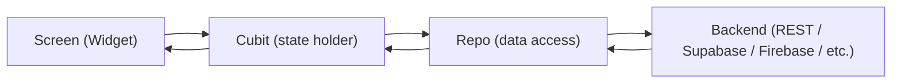
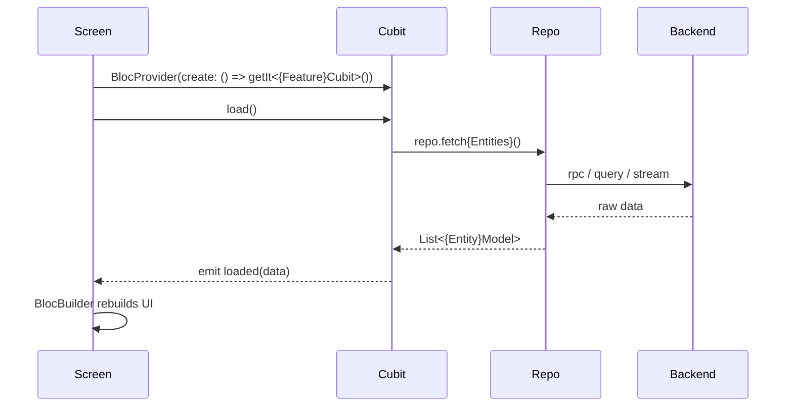

# Flutter App Architecture Guide

This document is a generic, reusable reference describing the standard architecture and
conventions used to build Flutter applications in this workflow. It is written with
placeholders (`{app_name}`, `{feature_name}`, `{Entity}`, `{sub_flow}`, …) instead of any
project-specific names, so it can be handed to an AI coding agent as the blueprint for
scaffolding a **brand-new** Flutter project from scratch, or for reviewing/aligning an
existing one.

If you are an AI agent reading this to build a new app: follow every section below unless
the user explicitly asks for a different pattern. Section 19 contains a condensed
step-by-step checklist you can execute mechanically.

---

## 1. Overview & Philosophy

- **Feature-first structure.** Code is organized by feature/domain (`lib/features/{feature_name}/`),
  not by technical layer at the top level. Shared/cross-cutting code lives in `lib/core/`.
- **Strict layering per feature:** `Screen → Cubit → Repo → Backend`. Each layer only talks to
  the layer directly below it. Screens never call a repo directly; cubits never build widgets.
- **Single source of truth per layer.** A cubit owns UI state for its slice of the app. A repo
  owns access to one backend concern. A model owns the shape of one entity.
- **No `Either`/`Result`/functional-error wrapper types.** Errors are handled with plain
  `try/catch`: repos throw `Exception`s, cubits catch them and emit a `error(message)` state
  with an already-localized message string. This keeps the code approachable and avoids a
  functional-programming dependency purely for error plumbing.
- **Codegen-heavy, but boilerplate-light at the call site.** `freezed` + `json_serializable`
  generate the repetitive parts of state classes and models; hand-written code stays focused
  on behavior.
- **Composition root pattern for DI.** All dependencies are wired in one place
  (`lib/core/app_setup.dart`) using `get_it`, not scattered `Provider`s or manual singletons.



---

## 2. Tech Stack Baseline

Default dependency set. An agent may swap the backend client (e.g. Supabase → Firebase → a
custom REST client) but should keep the same *roles* filled — one package per concern below.

| Concern | Package(s) | Notes |
|---|---|---|
| State management | `flutter_bloc` | Cubit, not full Bloc, unless complex event sourcing is needed |
| Persisted state | `hydrated_bloc` | Only for cubits whose state must survive app restarts (e.g. theme, settings) |
| Immutable state/unions | `freezed_annotation` (+ `freezed` dev dep) | Cubit states and shared models |
| JSON (de)serialization | `json_annotation` (+ `json_serializable` dev dep) | Models |
| Dependency injection | `get_it` | Single composition root |
| Backend client | `supabase_flutter` (default) | Swappable per project |
| Localization | `easy_localization` | JSON translation files + generated keys |
| Environment/secrets | `flutter_dotenv` | Debug-time `.env`, replaced by `--dart-define` in release |
| Equality helpers | `equatable` | For plain (non-freezed) value classes when needed |
| Date/number formatting | `intl` | Also used to seed locale-aware date formatting |
| Identifiers | `uuid` | Client-generated IDs where needed |
| App/package metadata | `package_info_plus` | Version gating, "about" screens |
| Networking helpers | `url_launcher`, `cached_network_image` | External links, image caching |
| Codegen tooling (dev) | `build_runner`, `freezed`, `json_serializable` | Run via `dart run build_runner build --delete-conflicting-outputs` |
| Linting | `flutter_lints` | Baseline `analysis_options.yaml` |
| App icon generation | `flutter_launcher_icons` (dev) | Generates adaptive icons from one source asset |

`analysis_options.yaml` baseline:

```yaml
include: package:flutter_lints/flutter.yaml

linter:
  rules:

analyzer:
  errors:
    invalid_annotation_target: ignore
    duplicate_ignore: ignore

formatter:
  trailing_commas: preserve
  page_width: 120
```

---

## 3. Top-Level Project Structure

```
{app_name}/
├── lib/
│   ├── main.dart                 # bootstrap only
│   ├── main_wrapper.dart         # authenticated shell (bottom nav / sidebar), if applicable
│   ├── app/
│   │   └── app.dart              # root MaterialApp widget, theme + localization wiring
│   ├── generated/                 # localization codegen output (do not hand-edit)
│   │   ├── codegen_loader.g.dart
│   │   └── locale_keys.g.dart
│   ├── core/                      # shared/cross-cutting code (see section 4)
│   └── features/                  # one folder per feature (see section 5)
├── assets/
│   ├── images/
│   ├── svgs/
│   ├── logo/                      # source assets for flutter_launcher_icons
│   └── lang/                      # {locale}.json translation files
├── scripts/
│   └── build_release.sh           # see section 16
├── sql/                            # backend RPC/migration snippets, if using a SQL backend
├── test/                           # mirrors lib/ for pure-logic unit tests
├── android/ ios/ web/ macos/ linux/ windows/   # platform runners (Flutter-generated)
├── .env                            # local/debug secrets — gitignored, never committed with real values
├── flutter_launcher_icons.yaml
├── analysis_options.yaml
└── pubspec.yaml
```

---

## 4. `lib/core/` Layer

Everything reusable across more than one feature lives here. Nothing feature-specific
belongs in `core/`.

| Subfolder | Purpose |
|---|---|
| `app_setup.dart` | Composition root: registers every repo/cubit with `get_it` (section 6) |
| `bloc_observer.dart` | A `BlocObserver` that logs create/change/error/close events for debugging |
| `blocs/` | Cross-cutting cubits shared by the whole app shell — e.g. `theme/theme_cubit.dart` (persisted via `HydratedCubit`), `pages/pages_cubit.dart` (bottom-nav/tab index) |
| `config/` | `env_config.dart` (env/secrets, section 11), system UI/overlay style config, any platform-level HTTP overrides |
| `routes/` | `routes.dart` (barrel) + `app_route.dart` (`RoutesName` constants + `AppRouter`), see section 9 |
| `model/` | Domain models shared by 2+ features, using the freezed + json_serializable pattern (section 8) |
| `enum/` | Domain enums plus extensions that map an enum to a label/color/icon |
| `extensions/` | Small `BuildContext`/`String`/etc. extensions (e.g. `.tr` shortcuts, responsive helpers) |
| `util/` | Pure helper functions/classes with no Flutter or backend dependency (easy to unit test) |
| `l10n/` | Anything localization-adjacent that isn't a plain translation string (e.g. custom `MaterialLocalizations` delegate, locale-specific digit/month formatting) |
| `version/` | Force-update / min-supported-version gate, typically a widget that wraps `home:` and blocks the UI if the installed version is too old |
| `widgets/` | Shared design-system widgets: buttons, app bars, dialogs, loading/empty/error states, shimmer placeholders |

`main.dart` bootstrap order (keep this order — each step depends on the previous one):

```dart
void main() async {
  WidgetsFlutterBinding.ensureInitialized();
  await EasyLocalization.ensureInitialized();
  await initializeDateFormatting('{default_locale}');

  Bloc.observer = AppBlocObserver();

  await EnvConfig.init();

  // Initialize the backend client (Supabase/Firebase/custom) here, using EnvConfig values.

  await SystemChrome.setPreferredOrientations([
    DeviceOrientation.portraitUp,
    DeviceOrientation.portraitDown,
  ]);

  HydratedBloc.storage = await HydratedStorage.build(
    storageDirectory: HydratedStorageDirectory(
      (await getApplicationDocumentsDirectory()).path,
    ),
  );

  await Future.wait([
    di.setUp(),
  ]);

  runApp(
    EasyLocalization(
      supportedLocales: const [Locale('{locale_a}'), Locale('{locale_b}')],
      path: 'assets/lang',
      fallbackLocale: const Locale('{locale_b}'),
      saveLocale: true,
      startLocale: const Locale('{locale_a}'),
      child: {AppName}App(appRouter: AppRouter()),
    ),
  );
}
```

---

## 5. `lib/features/{feature_name}/` Layer

Every feature follows the same internal structure and exposes a single barrel file at its
root so the rest of the app imports one path per feature:

```
features/{feature_name}/
├── {feature_name}_screen.dart        # barrel: export './screens/{feature_name}_screen.dart';
├── blocs/
│   └── {sub_flow}/
│       ├── {sub_flow}_cubit.dart
│       ├── {sub_flow}_state.dart          # `part of` the cubit file, freezed union
│       └── {sub_flow}_cubit.freezed.dart  # generated, do not hand-edit
├── repo/
│   └── {feature_name}_repo.dart
├── screens/
│   └── {feature_name}_screen.dart
└── widgets/
    └── ...                             # feature-local widgets only (not shared)
```

A feature can have more than one `blocs/{sub_flow}/` if it manages more than one independent
piece of async state (e.g. a "list" flow and a "create" flow living in the same feature).

**Data flow for a typical read+action feature:**



**Standard freezed state union** used by nearly every cubit (extend with feature-specific
states as needed, e.g. `actionInProgress`, `actionSuccess`):

```dart
part of '{sub_flow}_cubit.dart';

@freezed
class {SubFlow}State with _${SubFlow}State {
  const factory {SubFlow}State.initial() = _Initial;
  const factory {SubFlow}State.loading() = _Loading;
  const factory {SubFlow}State.loaded(List<{Entity}Model> items) = _Loaded;
  const factory {SubFlow}State.error(String message) = _Error;
}
```

```dart
class {SubFlow}Cubit extends Cubit<{SubFlow}State> {
  {SubFlow}Cubit({required {Feature}Repo repo})
      : _repo = repo,
        super(const {SubFlow}State.initial());

  final {Feature}Repo _repo;

  Future<void> load() async {
    emit(const {SubFlow}State.loading());
    try {
      final items = await _repo.fetch{Entities}();
      emit({SubFlow}State.loaded(items));
    } catch (e) {
      emit({SubFlow}State.error(LocaleKeys.error_generic.tr()));
    }
  }
}
```

**Screen wiring:**

```dart
BlocProvider<{SubFlow}Cubit>(
  create: (_) => getIt<{SubFlow}Cubit>()..load(),
  child: const {Feature}Screen(),
);
```

---

## 6. Dependency Injection (`get_it`)

One rule, applied consistently everywhere: **repos are `registerLazySingleton`, cubits are
`registerFactory`.** Repos are stateless-ish data-access objects safe to share; cubits hold UI
state and must get a fresh instance every time a `BlocProvider` creates one.

External clients (backend SDK client, HTTP client, etc.) are registered once and injected
into every repo that needs them.

```dart
// lib/core/app_setup.dart
final getIt = GetIt.I;

Future<void> setUp() async {
  final client = Backend.instance.client;

  getIt.registerLazySingleton<BackendClient>(() => client);

  // Cross-cutting cubits (no repo dependency)
  getIt.registerFactory(() => ThemeCubit());
  getIt.registerFactory(() => PagesCubit());

  // Repeat this block for each feature:
  final {feature}Repo = {Feature}Repo(client: client);
  getIt.registerLazySingleton<{Feature}Repo>(() => {feature}Repo);
  getIt.registerFactory(
    () => {Feature}Cubit(repo: {feature}Repo),
  );
}
```

Call `di.setUp()` once in `main.dart`, after env/backend initialization and before
`runApp`.

---

## 7. State Management Convention

- Use `Cubit`, not full `Bloc`, unless a feature genuinely needs event transformers
  (debounce/throttle) or an audit trail of discrete events.
- Every cubit's state is a `freezed` union (see section 5). Never use a mutable class or a
  loose `bool isLoading` + `dynamic data` combo.
- Only wrap a cubit in `HydratedCubit` when its state must survive an app restart (theme,
  locale, onboarding-seen flags, saved filters). Everything else is a plain `Cubit` that
  resets on app start.
- UI consumes state with `BlocBuilder`/`BlocConsumer`, using `buildWhen`/`listenWhen` to
  separate "data changed, rebuild" from "one-off side effect, show a snackbar/navigate".
- Prefer `state.maybeWhen(...)` / `state.maybeMap(...)` in widgets over long `if` chains.

---

## 8. Model Convention

Models use `freezed` (immutability + `copyWith` + equality) together with
`json_serializable` (JSON mapping). Snake_case backend field names are mapped explicitly
with `@JsonKey`.

```dart
import 'package:freezed_annotation/freezed_annotation.dart';

part '{entity}_model.freezed.dart';
part '{entity}_model.g.dart';

@freezed
class {Entity}Model with _${Entity}Model {
  const factory {Entity}Model({
    String? id,
    required String name,
    @JsonKey(name: 'created_at') required DateTime createdAt,
    @JsonKey(name: 'is_active') @Default(true) bool isActive,
  }) = _{Entity}Model;

  factory {Entity}Model.fromJson(Map<String, dynamic> json) =>
      _${Entity}ModelFromJson(json);
}
```

Shared models (used by 2+ features) live in `lib/core/model/`. Models used by exactly one
feature may live next to that feature instead, but default to `core/model/` unless there's a
clear reason not to.

After adding/changing a model or a cubit state, regenerate code:

```bash
dart run build_runner build --delete-conflicting-outputs
```

---

## 9. Routing Convention

Default to classic `Navigator` 1.0 with named routes — simple, predictable, and enough for
most apps built this way:

```dart
@immutable
class RoutesName {
  static const String home = '/home';
  static const String {routeName} = '/{route-path}';
}

class AppRouter {
  Route<dynamic> generateRoute(RouteSettings settings) {
    switch (settings.name) {
      case RoutesName.home:
        return _pageRoute(const HomeScreen());
      default:
        return _pageRoute(
          Scaffold(body: Center(child: Text('No route defined for ${settings.name}'))),
        );
    }
  }

  Route<dynamic> _pageRoute(Widget child) => CupertinoPageRoute(builder: (_) => child);
}
```

> **Decision point:** if the project needs deep linking, nested navigation, or web URL sync,
> use `go_router` instead — but pick ONE routing approach and use it everywhere. Do not add
> `go_router` as a dependency and then keep using `Navigator` throughout (that inconsistency
> should never happen).

Auth/version gating is not done inside the router. Instead, a gate widget wraps `home:`:

```dart
home: VersionGate(
  child: const AuthGate(), // decides: sign-in screen vs. authenticated shell
),
```

---

## 10. Theming & Localization

**Theming:** Material 3, seed-color based, persisted through a `HydratedCubit` so the user's
choice survives restarts.

```dart
BlocProvider<ThemeCubit>(
  create: (_) => getIt<ThemeCubit>(),
  child: BlocBuilder<ThemeCubit, ThemeState>(
    builder: (context, state) => MaterialApp(
      themeMode: state.themeMode,
      theme: ThemeData(colorScheme: ColorScheme.fromSeed(seedColor: state.seedColor)),
      darkTheme: ThemeData(
        colorScheme: ColorScheme.fromSeed(
          seedColor: state.seedColor,
          brightness: Brightness.dark,
        ),
      ),
      onGenerateRoute: appRouter.generateRoute,
      home: const AppEntryPoint(),
    ),
  ),
);
```

**Localization:** `easy_localization` with plain JSON files per locale.

```
assets/lang/
├── en.json
└── {locale_b}.json
```

- Register `assets/lang/` under `flutter: assets:` in `pubspec.yaml`.
- Generate `LocaleKeys` (via the `easy_localization` generator or a helper script) so keys
  are typo-checked at compile time instead of raw strings: `LocaleKeys.error_generic.tr()`.
- Wire `context.localizationDelegates` + `context.supportedLocales` +
  `context.locale` into `MaterialApp`.
- Keep a locale-aware date/number formatting util in `core/l10n/` for any locale whose
  default Flutter/`intl` formatting isn't sufficient.

---

## 11. Environment & Secrets Convention

Two-tier config so debug builds are convenient and release builds never ship a bundled
secrets file:

```dart
class EnvConfig {
  static late final String backendUrl;
  static late final String backendKey;

  static Future<void> init() async {
    const definedUrl = String.fromEnvironment('BACKEND_URL');
    const definedKey = String.fromEnvironment('BACKEND_KEY');

    if (definedUrl.isNotEmpty && definedKey.isNotEmpty) {
      backendUrl = definedUrl;
      backendKey = definedKey;
      return;
    }

    await dotenv.load(fileName: '.env');
    backendUrl = dotenv.env['BACKEND_URL'] ?? (throw Exception('BACKEND_URL missing'));
    backendKey = dotenv.env['BACKEND_KEY'] ?? (throw Exception('BACKEND_KEY missing'));
  }
}
```

- `.env` is used for local/debug runs only, is gitignored, and is listed under
  `flutter: assets:` so `flutter_dotenv` can load it on-device during development.
- Release builds pass secrets via `--dart-define=BACKEND_URL=...` (see section 16), so no
  secrets file ships inside the release artifact.
- CI writes a temporary `.env` from repository secrets purely so any dev-only asset paths
  still resolve; the actual release build uses `--dart-define`, not the `.env` values.

---

## 12. Error Handling Convention

- **Repo layer:** catch backend-specific exceptions, rethrow as a plain `Exception` with a
  clear message (or let it propagate if the message is already useful).
- **Cubit layer:** catch, then `emit({SubFlow}State.error(<localized message>))`. Never let an
  exception escape a cubit method silently.
- **No `Either`/`Result`/`fpdart`/`dartz`.** This keeps error handling readable for
  contributors unfamiliar with functional programming and keeps the cubit state union as the
  single place UI checks for error, avoiding a second parallel error channel.
- UI shows errors via a dedicated error widget/state (e.g. `ErrorView(message: ...)`) driven
  by `state.maybeWhen(error: (m) => ErrorView(message: m), orElse: () => ...)`.

---

## 13. Backend/Data Convention

Default backend is Supabase (Postgres + RPC + realtime), but the same pattern applies to any
backend:

- **Prefer RPC/stored functions over raw table CRUD from the UI layer.** Business logic
  (filtering, joins, authorization checks) lives in the backend function, not scattered
  across Dart repos.
- Repos take an injected client and only orchestrate calls — no business logic in repos:

```dart
class {Feature}Repo {
  {Feature}Repo({required BackendClient client}) : _client = client;
  final BackendClient _client;

  Future<List<{Entity}Model>> fetch{Entities}() async {
    final response = await _client.rpc('get_{entities}_with_filters', params: {
      'p_user_id': _client.auth.currentUser!.id,
    });
    return (response as List)
        .map((item) => {Entity}Model.fromJson(item as Map<String, dynamic>))
        .toList();
  }
}
```

- Keep every hand-written backend function/migration as a `.sql` file under `sql/` at the
  project root, even if the backend project itself is managed elsewhere. Each file starts
  with a header comment stating its purpose and how/where to run it:

```sql
-- Purpose: return {entities} for a user with optional status/date filters.
-- Run in the Supabase SQL Editor (or via migration tooling) against the project database.
create or replace function get_{entities}_with_filters(p_user_id uuid)
returns jsonb
language plpgsql
security definer
set search_path to 'public'
as $$
begin
  -- ...
end;
$$;

grant execute on function get_{entities}_with_filters(uuid) to authenticated;
```

This turns `sql/` into a readable audit trail of every backend contract the app depends on.

---

## 14. Naming Conventions

| Kind | Convention |
|---|---|
| Files & folders | `snake_case` |
| Classes | `PascalCase` |
| Feature folders | `lib/features/{feature_name}/` |
| Cubit files | `blocs/{sub_flow}/{sub_flow}_cubit.dart` + `{sub_flow}_state.dart` (`part of`) |
| Repo files | `repo/{feature_name}_repo.dart` |
| Screens | actual screens under `screens/`, thin barrel export at the feature root |
| Feature-local widgets | `widgets/` (plural — use this consistently; do not mix `widget/`/`widgets/` across features) |
| Generated files | `*.freezed.dart`, `*.g.dart`, always alongside their source file |
| Imports | Prefer `package:{app_name}/...` for cross-folder imports; relative `../` only within the same feature |

---

## 15. Testing Convention

```
test/
├── core/
│   └── util/{something}_test.dart      # pure-logic unit tests, no Flutter/backend deps
└── features/
    └── {feature_name}/
        └── blocs/{sub_flow}_cubit_test.dart   # optional: use bloc_test for cubit behavior
```

- Prioritize unit tests for pure logic in `core/util/` (formatters, calculators, parsers) —
  these are cheap and high-value.
- Cubit tests (with `bloc_test`) and widget tests are recommended for any feature with
  non-trivial branching logic, but are not mandatory for every feature.
- Delete the default Flutter counter `widget_test.dart` scaffold; do not leave stale
  boilerplate tests in the repo.

---

## 16. Build Script — `scripts/build_release.sh`

Generic, parameterized release build script. Adjust the two `dart-define` keys to match
whatever `EnvConfig` expects.

```bash
#!/usr/bin/env bash
set -euo pipefail

ROOT_DIR="$(cd "$(dirname "${BASH_SOURCE[0]}")/.." && pwd)"
cd "$ROOT_DIR"

ENV_FILE="${ENV_FILE:-$ROOT_DIR/.env}"
if [[ ! -f "$ENV_FILE" ]]; then
  echo "Error: .env file not found at $ENV_FILE"
  exit 1
fi

# Load .env (skip comments/blank lines; strip Windows CRLF).
while IFS= read -r line || [[ -n "$line" ]]; do
  line="${line%$'\r'}"
  [[ -z "$line" || "$line" =~ ^[[:space:]]*# ]] && continue
  key="${line%%=*}"
  value="${line#*=}"
  key="${key#"${key%%[![:space:]]*}"}"
  key="${key%"${key##*[![:space:]]}"}"
  if [[ -n "$key" ]]; then
    export "$key=$value"
  fi
done < "$ENV_FILE"

if [[ -z "${BACKEND_URL:-}" || -z "${BACKEND_KEY:-}" ]]; then
  echo "Error: BACKEND_URL and BACKEND_KEY are required in $ENV_FILE"
  exit 1
fi

KEY_PROPERTIES="$ROOT_DIR/android/key.properties"
if [[ ! -f "$KEY_PROPERTIES" ]]; then
  echo "Error: signing config not found at $KEY_PROPERTIES"
  exit 1
fi

STORE_FILE="$(grep -E '^storeFile=' "$KEY_PROPERTIES" | head -1 | cut -d= -f2-)"
STORE_FILE="${STORE_FILE%$'\r'}"
if [[ -z "$STORE_FILE" ]]; then
  echo "Error: storeFile is missing in $KEY_PROPERTIES"
  exit 1
fi

# Gradle resolves storeFile relative to android/app/
if [[ "$STORE_FILE" = /* ]]; then
  KEYSTORE_PATH="$STORE_FILE"
else
  KEYSTORE_PATH="$ROOT_DIR/android/app/$STORE_FILE"
fi

if [[ ! -f "$KEYSTORE_PATH" ]]; then
  echo "Error: keystore not found at $KEYSTORE_PATH"
  exit 1
fi

DART_DEFINES=(
  "--dart-define=BACKEND_URL=${BACKEND_URL}"
  "--dart-define=BACKEND_KEY=${BACKEND_KEY}"
)

VERSION_FULL="$(grep -E '^version:' "$ROOT_DIR/pubspec.yaml" | head -1 | awk '{print $2}')"
if [[ -z "$VERSION_FULL" ]]; then
  echo "Error: could not read version from pubspec.yaml"
  exit 1
fi

echo "Building release APK + AAB (v${VERSION_FULL}) from ${ENV_FILE} ..."
echo "  dart-defines: BACKEND_URL, BACKEND_KEY"
echo ""

flutter pub get
dart run build_runner build --delete-conflicting-outputs
flutter build apk --release "${DART_DEFINES[@]}"
flutter build appbundle --release "${DART_DEFINES[@]}"

APK_SRC="$ROOT_DIR/build/app/outputs/flutter-apk/app-release.apk"
AAB_SRC="$ROOT_DIR/build/app/outputs/bundle/release/app-release.aab"

if [[ ! -f "$APK_SRC" ]]; then
  echo "Error: APK not found at $APK_SRC"
  exit 1
fi
if [[ ! -f "$AAB_SRC" ]]; then
  echo "Error: AAB not found at $AAB_SRC"
  exit 1
fi

DIST_DIR="$ROOT_DIR/dist"
mkdir -p "$DIST_DIR"
DIST_APK="$DIST_DIR/{app_name}_v${VERSION_FULL}.apk"
DIST_AAB="$DIST_DIR/{app_name}_v${VERSION_FULL}.aab"
cp "$APK_SRC" "$DIST_APK"
cp "$AAB_SRC" "$DIST_AAB"

human_size() {
  local bytes
  bytes="$(wc -c < "$1" | tr -d ' ')"
  if command -v numfmt >/dev/null 2>&1; then
    numfmt --to=iec --suffix=B "$bytes"
  else
    echo "${bytes}B"
  fi
}

echo ""
echo "Build complete (v${VERSION_FULL}):"
echo "  APK: $DIST_APK ($(human_size "$DIST_APK"))"
echo "  AAB: $DIST_AAB ($(human_size "$DIST_AAB"))"
echo ""
echo "Also available at Flutter outputs:"
echo "  $APK_SRC"
echo "  $AAB_SRC"
```

Key properties of this script an agent should preserve when adapting it:

1. `set -euo pipefail` — fail fast, no silently-swallowed errors.
2. Everything resolves relative to the script's own location (`ROOT_DIR`), so it can be run
   from any working directory.
3. Every precondition (`.env`, required vars, `key.properties`, keystore file, version string)
   is validated explicitly with a clear error message before any build work starts.
4. Secrets are passed via `--dart-define`, never baked into the app bundle as a file.
5. Regenerates code (`build_runner`) before building, so a forgotten codegen step can never
   ship a stale build.
6. Outputs are copied to a version-stamped `dist/` folder, in addition to Flutter's default
   build output paths, so CI has one stable glob (`dist/*.apk`, `dist/*.aab`) to upload as
   artifacts regardless of Flutter's internal output layout.

---

## 17. CI/CD — GitHub Actions Template

`.github/workflows/{app_name}-android-release.yml`:

```yaml
name: Build {App Name} Android Release

on:
  workflow_dispatch:
  workflow_call:

permissions:
  contents: read

jobs:
  build:
    runs-on: ubuntu-latest
    defaults:
      run:
        working-directory: {app_name}

    steps:
      - name: Checkout source
        uses: actions/checkout@v4

      - name: Read app version
        id: version
        run: |
          FULL="$(grep -E '^version:' pubspec.yaml | head -1 | awk '{print $2}')"
          if [[ -z "$FULL" ]]; then
            echo "Could not read version from pubspec.yaml" >&2
            exit 1
          fi
          SEMVER="${FULL%%+*}"
          BUILD="${FULL#*+}"
          if [[ "$BUILD" == "$FULL" ]]; then BUILD="0"; fi
          echo "full=$FULL" >> "$GITHUB_OUTPUT"
          echo "semver=$SEMVER" >> "$GITHUB_OUTPUT"
          echo "build=$BUILD" >> "$GITHUB_OUTPUT"

      - name: Install Flutter
        uses: subosito/flutter-action@v2
        with:
          channel: stable
          cache: true

      - name: Write .env from secrets
        env:
          BACKEND_URL: ${{ secrets.BACKEND_URL }}
          BACKEND_KEY: ${{ secrets.BACKEND_KEY }}
        run: |
          if [[ -z "$BACKEND_URL" || -z "$BACKEND_KEY" ]]; then
            echo "Missing repository secrets BACKEND_URL and/or BACKEND_KEY." >&2
            exit 1
          fi
          printf 'BACKEND_URL=%s\nBACKEND_KEY=%s\n' "$BACKEND_URL" "$BACKEND_KEY" > .env

      - name: Decode Android keystore and write key.properties
        env:
          KEYSTORE_BASE64: ${{ secrets.ANDROID_KEYSTORE_BASE64 }}
          KEY_ALIAS: ${{ secrets.ANDROID_KEY_ALIAS }}
          STORE_PASSWORD: ${{ secrets.ANDROID_STORE_PASSWORD }}
          KEY_PASSWORD: ${{ secrets.ANDROID_KEY_PASSWORD }}
        run: |
          if [[ -z "$KEYSTORE_BASE64" || -z "$KEY_ALIAS" || -z "$STORE_PASSWORD" || -z "$KEY_PASSWORD" ]]; then
            echo "Missing Android signing secrets." >&2
            exit 1
          fi
          CLEAN_B64="$(printf '%s' "$KEYSTORE_BASE64" | tr -d '[:space:]')"
          if ! printf '%s' "$CLEAN_B64" | base64 --decode --ignore-garbage > android/app/release.keystore; then
            echo "Failed to decode ANDROID_KEYSTORE_BASE64." >&2
            exit 1
          fi
          if [[ ! -s android/app/release.keystore ]]; then
            echo "Decoded keystore is empty." >&2
            exit 1
          fi
          {
            echo "storePassword=$STORE_PASSWORD"
            echo "keyPassword=$KEY_PASSWORD"
            echo "keyAlias=$KEY_ALIAS"
            echo "storeFile=release.keystore"
          } > android/key.properties

      - name: Build release APK + AAB
        run: bash scripts/build_release.sh

      - name: Upload release artifacts
        uses: actions/upload-artifact@v4
        with:
          # Artifact names cannot contain '+'; use '-' instead of the build-number separator.
          name: {app_name}-v${{ steps.version.outputs.semver }}-${{ steps.version.outputs.build }}
          path: |
            {app_name}/dist/*.apk
            {app_name}/dist/*.aab
          if-no-files-found: error
          retention-days: 30
```

**Monorepo pattern (optional):** if the repository hosts multiple Flutter apps (e.g. a
patient app, an admin app, a TV/kiosk app), give each its own workflow file following the
template above, and add one root workflow that composes them via `workflow_call`:

```yaml
name: Build All Releases

on:
  workflow_dispatch:

jobs:
  app-one:
    uses: ./.github/workflows/{app_one}-android-release.yml
    secrets: inherit
  app-two:
    uses: ./.github/workflows/{app_two}-android-release.yml
    secrets: inherit
```

---

## 18. Icons & App Metadata

`flutter_launcher_icons.yaml` generates adaptive Android + iOS icons from one source image so
the app icon never has to be manually exported per platform/density:

```yaml
flutter_launcher_icons:
  android: "app_icon"
  ios: true
  image_path: "assets/logo/icon.png"
  min_sdk_android: 21
  adaptive_icon_background: "#FFFFFF"
  adaptive_icon_foreground: "assets/logo/icon_foreground.png"
```

Run with `dart run flutter_launcher_icons` after changing the source asset.

---

## 19. Scaffolding Checklist (for an AI agent building a new app)

When asked to create a new Flutter app following this architecture, execute in this order:

1. `flutter create {app_name}` (or set up `pubspec.yaml` manually if adding to a monorepo).
2. Add the baseline dependencies from section 2 to `pubspec.yaml`; set up `analysis_options.yaml`.
3. Create the `lib/core/` skeleton: `app_setup.dart`, `bloc_observer.dart`, `blocs/theme/`,
   `blocs/pages/`, `config/env_config.dart`, `routes/`, `model/`, `enum/`, `extensions/`,
   `util/`, `widgets/`.
4. Implement `EnvConfig` (section 11) and `.env.example`; add `.env` to `.gitignore`.
5. Implement the DI composition root in `app_setup.dart` (section 6) — start empty except for
   the backend client + `ThemeCubit`/`PagesCubit`.
6. Implement `lib/app/app.dart` (root widget, theming + localization wiring, section 10) and
   `lib/main.dart` (bootstrap order, section 4).
7. Set up `assets/lang/{locale}.json` and wire `easy_localization`.
8. For each feature requested by the user, scaffold the structure from section 5: repo, cubit
   + freezed state, screens, widgets, barrel file — then register the repo/cubit in
   `app_setup.dart`.
9. Add routes for each new screen to `RoutesName`/`AppRouter` (section 9).
10. If using Supabase (or another SQL backend), add any needed RPC functions under `sql/`
    with header comments (section 13).
11. Add `scripts/build_release.sh` (section 16) and `flutter_launcher_icons.yaml` (section 18).
12. Add the CI workflow (section 17) once signing/secrets are ready.
13. Delete the default counter app boilerplate and its stale test; add real unit tests under
    `test/core/util/` for any pure-logic helpers (section 15).
14. Run `dart run build_runner build --delete-conflicting-outputs` and `flutter analyze`
    before considering the scaffold done.
