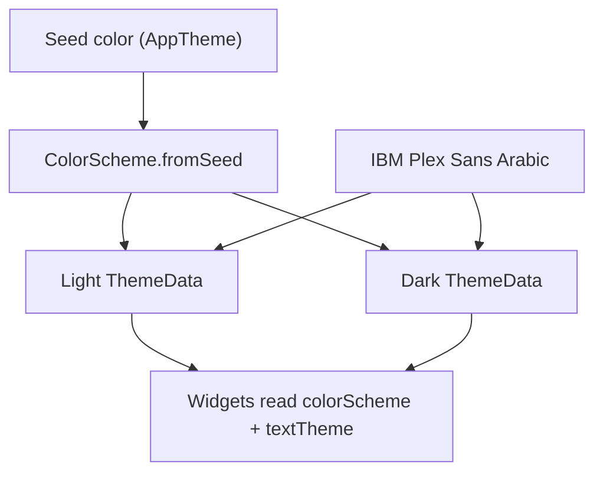

# Flutter Design System Guide

This document describes the **concrete visual design system** used by `dentist_booking_app`:
colors, typography, spacing, shapes, reusable UI components, icons, motion, and branding.

It is the companion to [FLUTTER_ARCHITECTURE_GUIDE.md](FLUTTER_ARCHITECTURE_GUIDE.md)
(structure, DI, Cubits, repos, build/CI). Together they form the full reference set.

**Purpose:** hand this file to an AI coding agent so it can **restyle another Flutter project**
to match this exact look and feel. Values here are concrete (not placeholders), because the
goal is visual replication of one specific style.

If you are an AI agent reading this to restyle an existing app: follow every section below,
then execute the **Restyle Checklist** in section 15 mechanically.

---

## 1. Overview & Design Philosophy

| Principle | What it means in practice |
|---|---|
| **Material 3** | `useMaterial3: true` everywhere. Prefer M3 widgets (`FilledButton`, `NavigationBar`, `ColorScheme.fromSeed`). |
| **Seed-based palette** | No hardcoded `AppColors` / hex palette file. One seed color → `ColorScheme.fromSeed` for light and dark. All UI colors come from `Theme.of(context).colorScheme`. |
| **Bordered-flat surfaces** | Cards and panels use thin `primary`-tinted borders (`opacity 0.10–0.15`) and `elevation: 0` more often than Material elevation. Soft shadows appear only on floating header cards. |
| **Bold text by default** | Labels, buttons, fields, and most body text use `FontWeight.bold` (or `w600`/`w700`). Light/regular weight is rare. |
| **Arabic / RTL first** | Default locale is Arabic. Font is IBM Plex Sans Arabic. Layout respects `Directionality`. |
| **Locked text scale** | `TextScaler.linear(1.0)` — system font-size accessibility scaling is intentionally disabled so layouts stay pixel-stable. |



---

## 2. Design Tokens

Copy this block as the single source of visual truth when restyling another app.

```yaml
fontFamily: IBM Plex Sans Arabic   # via google_fonts
material3: true
defaultSeed: Colors.blue           # Material named color
modes: [light, dark]

# User-switchable seed presets (AppTheme enum)
seeds:
  - deepPurple   # Colors.deepPurple
  - teal         # Colors.teal
  - orange       # Colors.orange
  - pink         # Colors.pink
  - blue         # Colors.blue (default)

# Semantic status colors (Material Colors.*, not ColorScheme)
status:
  pending:    { bg: orange@0.18, fg: orange }
  confirmed:  { bg: green@0.18,  fg: green }
  completed:  { bg: blue@0.18,   fg: blue }
  cancelled:  { bg: red@0.18,    fg: red }
  noShow:     { bg: red@0.18,    fg: red }
  morning:    { bg: green@0.18,  fg: green }
  evening:    { bg: blue@0.18,   fg: blue }

opacity:
  chipBg: 0.18
  softFill: 0.05–0.15
  inputFillAlpha: 20          # Color.withAlpha(20) on primary
  border: 0.10–0.35           # typically primary.withOpacity(0.10–0.15)
  mutedText: 0.55–0.70        # onSurface / outline
  cardShadow: 0.15            # Colors.black.withOpacity(0.15)

spacing: [2, 4, 6, 8, 10, 12, 14, 16, 18, 20, 24]
# Primary working set (use these first): 8, 12, 14, 16, 20

radius:
  xs: 8
  sm: 12–14                   # nested tiles, cancel radio options
  md: 16–18                   # chips, carousel images, compact cards
  lg: 20                      # DOMINANT — cards, inputs, dialogs, list items
  xl: 22                      # floating header cards, queue cards
  xxl: 26                     # glass / blurred status panels
  pill: 24–30                 # search bar, header curve
  sheet: 32                   # bottom sheet top corners, toasts

iconSize:
  sm: 18
  md: 20                      # default for most Hugeicons
  lg: 26                      # filled button icons
  nav: 23–25                  # bottom nav SVG
  hero: 70–100                # empty / error / no-internet states

controlHeight:
  button: 50–54
  textField: 55
  searchBar: 48
  bottomNav: 80
  appBar: 56                  # +95 / 120 / 145 with search variants
```

### Spacing usage (most common in the codebase)

| Token | Typical use |
|------:|---|
| 4–6 | Tight gaps inside chips / icon+label rows |
| 8 | Compact horizontal gaps |
| **12** | Default vertical gap between related widgets; common horizontal padding |
| **14** | Card inner padding (floating header cards) |
| **16** | List item padding; horizontal page inset for floating cards |
| **20** | Section spacing; field horizontal padding |
| 24 | Larger section breaks |

### Radius usage (most common)

| Radius | Count rank | Use |
|------:|:----------:|---|
| **20** | #1 | Cards, inputs, loading dialog, list items |
| **22** | #2 | Floating header cards, queue cards |
| **26** | #3 | Glass / blur panels |
| 16–18 | — | Chips, compact cards, cancel CTA |
| 24 | — | Search pill |
| 30 | — | `HeaderBackground` bottom curve |
| 32 | — | Bottom sheets, toasts |

---

## 3. Theming Setup

### Seed presets & persistence

```dart
enum AppMode { light, dark }

enum AppTheme {
  deepPurple(seedColor: Colors.deepPurple),
  teal(seedColor: Colors.teal),
  orange(seedColor: Colors.orange),
  pink(seedColor: Colors.pink),
  blue(seedColor: Colors.blue);   // default

  final Color seedColor;
  const AppTheme({required this.seedColor});
}

class ThemeCubit extends HydratedCubit<ThemeState> {
  ThemeCubit()
      : super(const ThemeState(mode: AppMode.light, theme: AppTheme.blue));

  void toggleMode() { /* light <-> dark */ }
  void setTheme(AppTheme theme) { /* change seed */ }
  void setMode(AppMode mode) { /* set light or dark */ }
  // fromJson / toJson persist mode.index + theme.index
}
```

### ThemeData builders (exact pattern)

```dart
ThemeData _buildLightTheme(Color color) {
  return ThemeData(
    useMaterial3: true,
    fontFamily: GoogleFonts.ibmPlexSansArabic().fontFamily,
    colorScheme: ColorScheme.fromSeed(
      seedColor: color,
      brightness: Brightness.light,
    ),
    navigationBarTheme: const NavigationBarThemeData(
      labelTextStyle: WidgetStatePropertyAll(
        TextStyle(fontSize: 12, fontWeight: FontWeight.w600),
      ),
    ),
  );
}

ThemeData _buildDarkTheme(Color color) {
  return ThemeData(
    useMaterial3: true,
    fontFamily: GoogleFonts.ibmPlexSansArabic().fontFamily,
    colorScheme: ColorScheme.fromSeed(
      seedColor: color,
      brightness: Brightness.dark,
    ),
    navigationBarTheme: const NavigationBarThemeData(
      labelTextStyle: WidgetStatePropertyAll(
        TextStyle(fontSize: 12, fontWeight: FontWeight.w600),
      ),
    ),
  );
}
```

### MaterialApp wiring

```dart
MaterialApp(
  themeMode: state.themeMode,          // from ThemeCubit
  theme: _buildLightTheme(state.seedColor),
  darkTheme: _buildDarkTheme(state.seedColor),
  builder: (context, child) {
    return MediaQuery(
      data: MediaQuery.of(context).copyWith(
        textScaler: const TextScaler.linear(1.0),
      ),
      child: child!,
    );
  },
  // ... localizations, home, routes
);
```

**Rules when porting to another app:**

1. Do **not** invent an `AppColors` class of hex values unless the product owner demands a fixed brand hex.
2. Always derive UI colors from `Theme.of(context).colorScheme`.
3. Keep `TextScaler.linear(1.0)` unless accessibility font scaling is explicitly required.
4. Persist theme choice with `HydratedCubit` (or equivalent) so light/dark + seed survive restarts.

---

## 4. Color Usage Patterns

### ColorScheme roles → where they appear

| Role | Typical use |
|---|---|
| `primary` | Brand accents, header background bar, CTA borders, bold titles, icon tints on empty states, logo tint |
| `onPrimary` | Text/icons on filled primary surfaces (when override needed) |
| `secondary` | Bottom-nav icon tint (`ColorFilter`) |
| `secondaryContainer` | Search bar fill, settings row background |
| `surface` | Card backgrounds, dialogs |
| `onSurface` | Default body text |
| `onSurfaceVariant` / `outline` | Muted captions, disabled icons, secondary labels (often at 0.55–0.7 opacity) |
| `primaryContainer` | Shimmer base color |
| `error` / `errorContainer` | Error panels, destructive callouts |
| `onError` | Text on error-filled surfaces |

### Soft fills & borders (recipes)

```dart
// Input / date-picker fill
colorScheme.primary.withAlpha(20)

// Card / list-item border
Border.all(color: colorScheme.primary.withOpacity(0.10))  // or 0.15

// Soft primary surface
colorScheme.primary.withOpacity(0.05)  // up to 0.15

// Muted caption
colorScheme.onSurface.withOpacity(0.55)  // or outline / 0.7

// Floating card shadow
BoxShadow(
  color: Colors.black.withOpacity(0.15),
  blurRadius: 20,
  offset: const Offset(0, 6),
)
```

### Status chips

Use Material named colors (not ColorScheme) for semantic statuses, with a soft background at **0.18** opacity and a solid foreground of the same hue. Pair with `CustomChip` (section 7).

| Status | Background | Foreground |
|---|---|---|
| Pending | `Colors.orange.withOpacity(0.18)` | `Colors.orange` |
| Confirmed / Active / Morning | `Colors.green.withOpacity(0.18)` | `Colors.green` |
| Completed / Evening | `Colors.blue.withOpacity(0.18)` | `Colors.blue` |
| Cancelled / No-show / Banned | `Colors.red.withOpacity(0.18)` | `Colors.red` |
| Suspended | `Colors.orange.withOpacity(0.18)` | `Colors.orange` |

---

## 5. Typography Usage Patterns

**Family:** IBM Plex Sans Arabic (set once on `ThemeData.fontFamily`).

**Default weight:** `FontWeight.bold`. Prefer `w600`/`w700` for section titles; `w900` only for hero guest-restriction headlines.

| UI role | Style |
|---|---|
| Screen / dialog title | `textTheme.headlineSmall` + `FontWeight.bold` + `colorScheme.primary` |
| Section title | `textTheme.titleMedium` + `FontWeight.w700`, often `fontSize: 18` |
| Card title | `textTheme.titleMedium` + `FontWeight.bold` |
| Body / buttons / fields | `textTheme.bodyMedium` + `FontWeight.bold` |
| Captions / meta | `textTheme.bodySmall` or `labelSmall`, muted (`outline` or `onSurface @ 0.55–0.7`) |
| Nav labels | `fontSize: 12`, `FontWeight.w600` (via `navigationBarTheme`) |
| Version string | `labelSmall`, `fontSize: 10`, `FontWeight.w600` |
| Section “view all” link | `bodySmall` / link styled in `primary` |

**Do not** invent many custom `TextStyle` objects. Start from `Theme.of(context).textTheme.*` and `.copyWith(...)`.

---

## 6. Iconography

| System | When to use |
|---|---|
| **hugeicons** (`HugeIcons.strokeRounded*`) | Default for almost all in-app icons (app bar, settings, empty states, actions) |
| **websafe_svg** + `assets/svgs/*.svg` | Bottom navigation only — paired active / inactive assets |
| **Material Icons** | Occasional utilities (chevrons, play, error_outline, favorite/heart) |

### Bottom-nav SVG set

```
assets/svgs/
├── home.svg / home-off.svg
├── booking.svg / booking-off.svg
├── tracking.svg / tracking-off.svg
└── profile.svg / profile-off.svg
```

Tint with:

```dart
WebsafeSvg.asset(
  iconPath,
  height: size, // 25 default, 23 for tracking-off
  colorFilter: ColorFilter.mode(
    colorScheme.secondary,
    BlendMode.srcIn,
  ),
);
```

### Icon size table

| Size | Use |
|-----:|---|
| 18 | Compact trailing icons |
| **20** | Default Hugeicons / outlined button icons |
| 23–25 | Bottom nav SVGs |
| 26 | Filled button icons |
| 70–100 | Empty / error / no-internet hero icons (often at ~0.3 opacity) |

---

## 7. Buttons & Chips

### `CustomFilledButton` (full reference)

```dart
class CustomFilledButton extends StatelessWidget {
  const CustomFilledButton({
    super.key,
    required this.text,
    required this.onPressed,
    this.icon,
    this.textColor,
  });

  final String text;
  final VoidCallback? onPressed;
  final Widget? icon;
  final Color? textColor;

  @override
  Widget build(BuildContext context) {
    final textTheme = Theme.of(context).textTheme;
    final colorScheme = Theme.of(context).colorScheme;

    return FilledButton.icon(
      style: FilledButton.styleFrom(
        minimumSize: const Size.fromHeight(50),
        iconSize: 26,
        disabledIconColor: colorScheme.outline,
      ),
      label: Text(
        text,
        style: textTheme.bodyMedium!.copyWith(
          fontWeight: FontWeight.bold,
          color: textColor ?? colorScheme.primary,
        ),
      ),
      icon: icon,
      onPressed: onPressed,
    );
  }
}
```

### `CustomOutlinedButton` (spec)

- `OutlinedButton.icon` / `FilledButton.styleFrom` for size
- Height **50**, `iconSize: 20`
- Border: `BorderSide(color: colorScheme.primary, width: 1)`
- Label: `bodyMedium` + bold + `primary`

### Auth / primary CTA variant (when used)

- Height **54**, radius **20**, no elevation/shadow, may show an inline spinner while loading.

### `CustomChip` (full reference)

```dart
class CustomChip extends StatelessWidget {
  const CustomChip({
    super.key,
    required this.text,
    required this.bgColor,
    required this.txtColor,
  });

  final String text;
  final Color bgColor;
  final Color txtColor;

  @override
  Widget build(BuildContext context) {
    final textTheme = Theme.of(context).textTheme;

    return Container(
      padding: const EdgeInsets.symmetric(horizontal: 12, vertical: 5),
      decoration: BoxDecoration(
        color: bgColor,
        borderRadius: BorderRadius.circular(16),
      ),
      child: Text(
        text,
        style: textTheme.bodySmall!.copyWith(
          fontWeight: FontWeight.bold,
          color: txtColor,
        ),
      ),
    );
  }
}
```

---

## 8. Navigation & App Bar

### Bottom navigation (`CustomNavBar`)

```dart
NavigationBar(
  height: 80,
  elevation: 0,
  selectedIndex: selectedIndex,
  onDestinationSelected: onItemSelected,
  animationDuration: const Duration(milliseconds: 300),
  destinations: [
    NavigationDestination(
      tooltip: '',
      icon: buildItemIcon('assets/svgs/home-off.svg'),
      selectedIcon: buildItemIcon('assets/svgs/home.svg'),
      label: /* localized */,
    ),
    // booking, tracking, profile …
  ],
);
```

**Specs:**

| Property | Value |
|---|---|
| Height | **80** |
| Elevation | **0** |
| Animation | **300 ms** |
| Icons | SVG active / `-off` inactive, tinted `colorScheme.secondary` |
| Label style | 12 / w600 (from theme) |

### App bar (`CustomAppBar`)

Visual structure:

```
[ leading? ]     [ HugeIcon + Title (centered) ]     [ action? ]
                         optional search row below
```

| Property | Value |
|---|---|
| Base preferred height | **56** |
| With search variants | **95 / 120 / 145** |
| Elevation | **1** (default) |
| Title | HugeIcon (~23, `primary`) + `titleMedium` bold |
| Leading | RTL-aware back arrow (`Directionality`) |
| Search field | Height **48**, fill `secondaryContainer`, radius **24**, icons size 20 |

When restyling another app: keep the **centered icon + title** pattern and the **pill search bar**; do not switch to a left-aligned Material default title unless required.

---

## 9. Cards & List Items

### Floating header card (signature pattern)

Used over a colored header on home/profile-style screens.

1. **`HeaderBackground`** — solid `primary` bar, height **140**, bottom corners radius **30**, then **60** spacer so a card can overlap.
2. **Floating card** — positioned near `top: 88`, horizontal inset **16**:

| Property | Value |
|---|---|
| Padding | **14** |
| Radius | **22** |
| Fill | `surface` (optional light surface gradient) |
| Border | `primary.withOpacity(0.10)` |
| Shadow | black `@0.15`, blur **20**, offset `(0, 6)` |
| Content | Leading circular logo/avatar + primary label + bold title + meta row |

```dart
// HeaderBackground core
Container(
  height: 140,
  width: double.infinity,
  decoration: BoxDecoration(
    color: colors.primary,
    borderRadius: const BorderRadius.only(
      bottomLeft: Radius.circular(30),
      bottomRight: Radius.circular(30),
    ),
  ),
);
```

### List item card (e.g. booking row)

| Property | Value |
|---|---|
| Radius | **20** |
| Padding | **16** |
| Border | `primary.withOpacity(0.15)` |
| Fill / elevation | Usually **none** (bordered-flat) |
| Chips | Status + shift via `CustomChip` |
| Nested callouts | Same radius 20 |

### Active / queue cards

| Variant | Radius | Notes |
|---|------:|---|
| Active booking row | ~18 | Light border + soft shadow; expand/collapse with scale+fade |
| Active queue card | **22** | Stronger primary border (~0.4); circular **60** px stat icons |

### Settings row (`SettingItem` pattern)

- Fill: `secondaryContainer`
- Radius: **20**
- Height: **55** (or **72** with subtitle)
- Leading: circular icon badge

---

## 10. Dialogs, Bottom Sheets & Toasts

| Surface | Shape / chrome |
|---|---|
| Bottom sheet | Top corners radius **32**, drag handle, safe area, extra bottom padding (~50) |
| Cancel / action sheet content | Section heading + radio tiles radius **14** + filled CTA radius **18** |
| `LoadingDialog` | Radius **20**, compact box (~100×200), centered `CircularProgressIndicator` |
| Alert dialogs | Radius **16** |
| Toasts | Radius **32**, white ~12px text, fade animation, bottom offset ~**90** |

Dialog title header pattern: height ~**100**, `headlineSmall` bold primary title + muted subtitle + thin primary divider.

Footer dialog actions: primary `ElevatedButton` + outlined cancel in a row, min size around **100×42**.

---

## 11. Empty / Error / Loading / Shimmer States

| State | Visual pattern |
|---|---|
| Empty list | Hero icon **~70** at `primary @ ~0.3` + muted `bodyMedium` message |
| Error list | Hero icon **~80** primary + `titleMedium` @ ~0.7 |
| No internet | Hero icon **~100** muted + bold title + outline caption + pull-to-refresh / retry |
| Loading dialog | Centered spinner in rounded surface box (radius 20) |
| List shimmer | `Shimmer.fromColors(baseColor: primaryContainer, highlightColor: primary)` skeleton at radius **20** |
| Ads / media shimmer | Same shimmer colors, block radius **16** |
| Glass status skeleton | `BackdropFilter` blur (~σ18) + radius **26** (not the shimmer package) |
| Glass error panel | Same glass chrome + pill retry button |

**Restyle rule:** never leave a blank `CircularProgressIndicator` alone in a full screen for empty/error — always use **icon hero + short muted text** (+ optional CTA).

---

## 12. Motion & Transitions

| Pattern | Spec | Where |
|---|---|---|
| Entrance fade + slide | `TweenAnimationBuilder`, ~**20 px** slide, **300–650 ms** | Cards, settings rows, queue panels |
| Nav destination | **300 ms** | `NavigationBar.animationDuration` |
| Page push | **`CupertinoPageRoute`** | All named routes |
| Small state change | `AnimatedContainer` / `AnimatedSwitcher` | Service circles, carousel dots, search clear |
| Carousel page | **800 ms**, `Curves.fastOutSlowIn` | Banner carousel |
| Toast | Fade in/out | Styled toast |
| Glass panels | `BackdropFilter` blur σ~**18** | Booking status panels |

Default list/card entrance sketch:

```dart
TweenAnimationBuilder<double>(
  tween: Tween(begin: 0, end: 1),
  duration: const Duration(milliseconds: 400),
  builder: (context, value, child) {
    return Opacity(
      opacity: value,
      child: Transform.translate(
        offset: Offset(0, 20 * (1 - value)),
        child: child,
      ),
    );
  },
  child: /* card */,
);
```

---

## 13. RTL / Arabic Considerations

| Topic | Convention |
|---|---|
| Default locale | `Locale('ar')` as `startLocale`; also support `en` |
| Font | IBM Plex Sans Arabic (theme-wide) |
| Material localizations | Custom delegate for Algerian month names + **Latin digits** (force Western 0–9) |
| Back / chevrons | Flip based on `Directionality.of(context)` |
| Text fields | Respect RTL; horizontal padding stays 20 on both sides |
| Body / section copy | Often `TextAlign.right` when Arabic-first |
| Nav / layout | Prefer `EdgeInsetsDirectional` / `AlignmentDirectional` when adding new widgets |

When restyling a non-Arabic app you may keep LTR, but still:

1. Use the same font **or** swap to a Latin-friendly Google Font while keeping the same weight/size roles.
2. Keep `Directionality`-safe widgets so Arabic can be added later without rewriting layouts.

---

## 14. Branding & Splash

### Launcher icons (`flutter_launcher_icons.yaml`)

```yaml
flutter_launcher_icons:
  image_path_android: "assets/logo/icon_android.png"
  image_path_ios: "assets/logo/icon_android.png"
  android: "app_icon"
  adaptive_icon_foreground_inset: 0
  adaptive_icon_background: "#ffffff"
  adaptive_icon_foreground: "assets/logo/foreground.png"
  adaptive_icon_monochrome: "assets/logo/monochrome.png"
  min_sdk_android: 21
  remove_alpha_ios: true
  background_color_ios: "#ffffff"
  ios: true
  remove_alpha_channel_ios: true
```

### Splash / launch

- Android `launch_background.xml`: solid **white** (`#ffffff`), no centered logo.
- iOS launch storyboard: match white / clean brand background.
- In-app logo (`assets/images/logo.png`): tint with `colorScheme.primary` when used as a monochrome brand mark.

### Footer branding (optional)

Small “Made with ❤ …” line: `bodySmall` / w500, heart in `Colors.redAccent` size ~16.

---

## 15. Restyle Checklist (for an AI agent)

When asked to make **another** Flutter project match this design system, execute in order:

1. **Font** — Add `google_fonts`. Set `ThemeData.fontFamily` to `GoogleFonts.ibmPlexSansArabic().fontFamily` (or an agreed Latin substitute) on both light and dark themes.
2. **ColorScheme** — Remove hardcoded hex/`AppColors` usage where possible. Build light + dark with `ColorScheme.fromSeed(seedColor: …, brightness: …)` and `useMaterial3: true`. Default seed: `Colors.blue` unless the product owner provides a brand hex (then use that as the seed).
3. **ThemeCubit (optional but recommended)** — Add `AppMode` + `AppTheme` presets and a `HydratedCubit` so users can switch light/dark (and optionally seed color). Wire into `MaterialApp.themeMode` / `theme` / `darkTheme`.
4. **Text scale lock** — Wrap `MaterialApp.builder` with `TextScaler.linear(1.0)` unless accessibility scaling is required.
5. **Tokens sweep** — Replace one-off paddings/radii with the scales in section 2. Prefer radius **20** for cards/inputs, **22** for floating headers, **32** for bottom sheets. Prefer spacing **8 / 12 / 14 / 16 / 20**.
6. **Buttons** — Rebuild primary/secondary actions to height **50**, bold `bodyMedium` labels, filled + outlined variants as in section 7. Icon sizes 26 (filled) / 20 (outlined).
7. **Inputs** — Height ~**55**, fill `primary.withAlpha(20)`, radius **20**, bold body text, transparent/subtle borders.
8. **Bottom nav** — `NavigationBar` height **80**, elevation **0**, 300 ms animation, SVG (or Hugeicons) active/inactive pair tinted with `secondary`. Labels 12 / w600.
9. **App bar** — Centered icon + bold title; RTL-aware back; optional pill search (height 48, radius 24, `secondaryContainer`).
10. **Header + floating card** — On profile/home summary screens, use primary curved header (140 / radius 30) + overlapping card (radius 22, soft shadow, primary border @0.10).
11. **Cards / list items** — Bordered-flat radius 20, padding 16, status chips via soft Material colors @0.18.
12. **Empty / error / loading** — Icon hero + muted caption; shimmer skeletons with `primaryContainer` ↔ `primary`; loading dialog radius 20.
13. **Motion** — Add fade+slide entrance (~20 px / 300–650 ms) to lists/cards; use `CupertinoPageRoute` for pushes.
14. **Status colors** — Map domain statuses to the orange/green/blue/red table in section 4.
15. **Icons** — Prefer `hugeicons` stroke-rounded set at size 20; keep Material icons only for utilities.
16. **RTL** — If Arabic is in scope: IBM Plex Sans Arabic, `startLocale: ar`, Directionality-safe layout, Latin digits if required by product.
17. **Branding** — White adaptive launcher background; white splash; tint in-app logo with `primary`.
18. **Verify** — Run the app in light and dark, on a small phone, and (if Arabic) with RTL enabled. Confirm no leftover hard hex colors on major screens, and that radii/spacing feel consistent with section 2.

---

## Quick “looks right” checklist

After restyling, a screen “matches this design system” when:

- [ ] One seed-driven `ColorScheme` (light + dark), no random hex islands
- [ ] IBM Plex Sans Arabic (or agreed substitute) + **bold** labels/buttons
- [ ] Cards/inputs mostly **radius 20**, floating headers **22**, sheets **32**
- [ ] Surfaces are **bordered-flat** more than elevated
- [ ] Bottom nav is **80** tall, elevation 0
- [ ] Empty/error states show a large muted icon + short text
- [ ] Status chips use soft Material color backgrounds at **0.18**
- [ ] Subtle entrance motion on lists/cards
- [ ] Text scale locked to 1.0 (unless product says otherwise)
