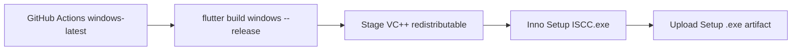

# Flutter Windows GitHub Release Guide

This document is a **generic, reusable blueprint** for shipping a Flutter **Windows desktop**
app as a single **Setup `.exe` installer** via **GitHub Actions**.

It is derived from a proven pattern (GitHub Actions on `windows-latest` → Flutter Windows
release → Inno Setup 6 installer → upload artifact), rewritten with placeholders so an AI
coding agent can apply it to **any** Flutter Windows project.

If you are an AI agent: follow every section and execute the **Scaffolding Checklist**
(section 10) mechanically unless the user asks for a different packaging tool.

Placeholders used throughout:

| Placeholder | Meaning |
|---|---|
| `{app_name}` | Flutter package / project folder name (e.g. `my_desktop_app`) |
| `{App Display Name}` | Human-readable product name shown in Start Menu / installer |
| `{Publisher}` | Company / publisher string |
| `{AppExeName}.exe` | Binary name produced by Flutter (usually `{app_name}.exe`) |
| `{OutputBaseName}` | Installer filename stem (e.g. `My-App-Setup`) |
| `{AppId}` | Stable Inno Setup `AppId` GUID — **never change between releases** |
| `{BACKEND_URL}` / `{BACKEND_KEY}` | Env/secret keys your app needs at build time (adapt names) |

---

## 1. Goal & Philosophy

**Goal:** from a GitHub Action run (manual or called by another workflow), produce one
distributable file:

```text
{OutputBaseName}-{semver}.exe
```

that an end user can install on any modern 64-bit Windows 10/11 PC without installing Flutter.

**Pipeline:**



**Non-negotiables:**

1. Builds **must** run on **Windows** runners (`runs-on: windows-latest`). macOS/Linux cannot
   produce a Flutter Windows release binary.
2. Prefer a **Setup installer** (Inno Setup) over zipping the raw `Release/` folder — end users
   get Start Menu shortcuts, uninstall, and automatic VC++ runtime install when needed.
3. Secrets for release builds go through **GitHub Actions secrets** → temporary `.env` on the
   runner → `--dart-define=...` at build time (same split as mobile release guides).
4. Keep installer **identity** (`AppId`, display name, publisher, output base name) in one
   config file (`config.ps1`), not scattered across scripts.

---

## 2. Project Layout to Create

Inside the Flutter app folder (`{app_name}/`):

```text
{app_name}/
├── pubspec.yaml
├── .env                          # local only; gitignored — CI writes this from secrets
├── windows/                      # Flutter Windows runner (flutter create / enable)
│   └── runner/resources/app_icon.ico
├── installer/
│   └── windows/
│       ├── config.ps1            # identity + paths (single source of truth)
│       ├── build_release.ps1     # one-shot: Flutter → redist → Inno
│       ├── {InstallerScript}.iss # Inno Setup 6 script
│       └── redist/
│           ├── README.md         # documents VC_redist.x64.exe
│           └── VC_redist.x64.exe # gitignored; downloaded by script if missing
└── output/
    └── windows/                  # gitignored — final Setup-*.exe lands here
```

At the **repository** root (monorepo or single-app repo):

```text
.github/workflows/
└── {app_name}-windows-release.yml
```

Optional monorepo composer:

```text
.github/workflows/build-all-releases.yml   # workflow_call → per-app workflows
```

---

## 3. GitHub Actions Workflow (template)

Create `.github/workflows/{app_name}-windows-release.yml`:

```yaml
name: Build {App Display Name} Windows Release

on:
  workflow_dispatch:
  workflow_call:

permissions:
  contents: read

jobs:
  build:
    runs-on: windows-latest
    defaults:
      run:
        working-directory: {app_name}

    steps:
      - name: Checkout source
        uses: actions/checkout@v4

      - name: Read app version
        id: version
        shell: pwsh
        run: |
          $line = Select-String -Path 'pubspec.yaml' -Pattern '^\s*version:\s*(\S+)' | Select-Object -First 1
          if (-not $line) { throw 'Could not read version from pubspec.yaml' }
          $full = $line.Matches[0].Groups[1].Value.Trim()
          $semver = ($full -split '\+')[0]
          "full=$full" >> $env:GITHUB_OUTPUT
          "semver=$semver" >> $env:GITHUB_OUTPUT
          Write-Host "Version: $full (semver: $semver)"

      - name: Install Flutter
        uses: subosito/flutter-action@v2
        with:
          channel: stable
          cache: true

      - name: Flutter version
        run: flutter --version

      - name: Enable Windows desktop
        run: flutter config --enable-windows-desktop

      - name: Install Inno Setup 6
        run: choco install innosetup --no-progress -y
        # Chocolatey is available on windows-latest; ISCC.exe lands on PATH.
        working-directory: .

      - name: Write .env from secrets
        shell: pwsh
        env:
          BACKEND_URL: ${{ secrets.BACKEND_URL }}
          BACKEND_KEY: ${{ secrets.BACKEND_KEY }}
        run: |
          if ([string]::IsNullOrWhiteSpace($env:BACKEND_URL) -or [string]::IsNullOrWhiteSpace($env:BACKEND_KEY)) {
            throw "Missing repository secrets BACKEND_URL and/or BACKEND_KEY. Add them under Settings → Secrets and variables → Actions."
          }
          $content = "BACKEND_URL=$($env:BACKEND_URL)`nBACKEND_KEY=$($env:BACKEND_KEY)`n"
          # No BOM — PowerShell readers must match keys exactly.
          [System.IO.File]::WriteAllText((Join-Path (Get-Location) '.env'), $content)

      - name: Build installer (Flutter + Inno Setup)
        shell: pwsh
        run: |
          powershell -ExecutionPolicy Bypass -File installer\windows\build_release.ps1 -Clean

      - name: Upload Setup installer
        uses: actions/upload-artifact@v4
        with:
          # Artifact names cannot contain '+'; use semver only.
          name: {OutputBaseName}-${{ steps.version.outputs.semver }}
          path: {app_name}/output/windows/*.exe
          if-no-files-found: error
          retention-days: 30
```

### Workflow design rules

| Rule | Why |
|---|---|
| `runs-on: windows-latest` | Flutter Windows + Visual Studio toolchain + Inno Setup |
| `workflow_dispatch` + `workflow_call` | Manual runs + monorepo “build all” composition |
| `working-directory: {app_name}` | Supports monorepos; for a single-app repo at root, omit this and adjust paths |
| Install Inno via `choco install innosetup` | Reliable on GitHub-hosted Windows runners |
| Write `.env` with **no BOM** | Avoids key-matching bugs in PowerShell `.env` parsers |
| Call `build_release.ps1 -Clean` | Same script locally and in CI — one source of truth |
| Upload `output/windows/*.exe` | Stable glob independent of Flutter’s internal build tree |
| Artifact name uses **semver** only | GitHub artifact names cannot contain `+` |

### Required repository secrets

Rename to match your app’s `EnvConfig` / dart-defines:

- `BACKEND_URL`
- `BACKEND_KEY`

(Or whatever keys `build_release.ps1` reads from `.env`.)

### Optional monorepo composer

```yaml
name: Build All Releases

on:
  workflow_dispatch:

permissions:
  contents: read

jobs:
  windows-app:
    uses: ./.github/workflows/{app_name}-windows-release.yml
    secrets: inherit
```

---

## 4. `config.ps1` — Installer Identity (template)

`installer/windows/config.ps1` is the **only** place that should define product identity:

```powershell
# Single source of truth for Windows installer identity and paths.

$script:AppConfig = [ordered]@{
    AppName        = '{App Display Name}'
    AppPublisher   = '{Publisher}'
    AppExeName     = '{AppExeName}.exe'
    # Stable AppId — do NOT change between releases (upgrades/uninstall rely on it).
    AppId          = '{{GENERATE-A-STABLE-GUID-AND-KEEP-IT}}'
    OutputBaseName = '{OutputBaseName}'
    RegistryKey    = 'Software\{Publisher}\{App Display Name}'
}

$script:PathConfig = [ordered]@{
    IssFile           = 'installer\windows\{InstallerScript}.iss'
    RedistDir         = 'installer\windows\redist'
    RedistFileName    = 'VC_redist.x64.exe'
    FlutterReleaseDir = 'build\windows\x64\runner\Release'
    DefaultOutputDir  = 'output\windows'
    AppIcon           = 'windows\runner\resources\app_icon.ico'
}

$script:VcRedistUrl = 'https://aka.ms/vs/17/release/vc_redist.x64.exe'
```

**Agent rules:**

1. Generate a real GUID for `AppId` once and never rotate it casually.
2. `AppExeName` must match the exe Flutter actually produces under
   `build\windows\x64\runner\Release\`.
3. Keep `OutputBaseName` URL/filesystem-safe (letters, digits, hyphens).

---

## 5. `build_release.ps1` — What the Script Must Do

The CI step should only invoke this script. Implement (or adapt) a PowerShell script that:

1. Resolves project root from `installer\windows\` → `..\..`
2. Dot-sources `config.ps1`
3. Fails if not on Windows (`$env:OS -ne 'Windows_NT'`)
4. Reads **semver** from `pubspec.yaml` (`version: x.y.z+build` → use `x.y.z`)
5. Ensures `flutter` and `ISCC.exe` are on PATH (or `INNO_SETUP_PATH`)
6. Optionally `-Clean` deletes `build\windows`
7. Runs `flutter pub get`
8. Reads required keys from `.env` (no BOM; skip comments/blank lines)
9. Runs:

```powershell
flutter build windows --release `
  "--dart-define=BACKEND_URL=$url" `
  "--dart-define=BACKEND_KEY=$key"
```

10. Ensures `installer\windows\redist\VC_redist.x64.exe` exists (download from
    `https://aka.ms/vs/17/release/vc_redist.x64.exe` if missing; **do not commit** the binary)
11. Invokes Inno Setup:

```powershell
& $iscc @(
  "/DMyAppName=`"$($AppConfig.AppName)`"",
  "/DMyAppVersion=`"$appVersion`"",
  "/DMyAppPublisher=`"$($AppConfig.AppPublisher)`"",
  "/DMyAppExeName=`"$($AppConfig.AppExeName)`"",
  "/DMyAppId=`"$($AppConfig.AppId)`"",
  "/DMyAppOutputBase=`"$($AppConfig.OutputBaseName)`"",
  "/DMyRegistryKey=`"$($AppConfig.RegistryKey)`"",
  "/DProjectRoot=`"$ProjectRoot`""
) "/O$outDir" $issPath
```

12. Verifies `{OutputBaseName}-{version}.exe` exists under `output\windows\`
13. Optionally prints SHA256 of the installer

**Useful switches to support:**

| Switch | Purpose |
|---|---|
| `-Clean` | Delete `build\windows` before building (use in CI) |
| `-SkipBuild` | Package an existing Release folder only |
| `-OutputDir` | Override `output\windows` |
| `-SkipRedistDownload` | Fail if redistributable missing (air-gapped builds) |

**Local one-liner (same as CI):**

```powershell
powershell -ExecutionPolicy Bypass -File installer\windows\build_release.ps1 -Clean
```

---

## 6. Inno Setup Script Essentials

Create `installer/windows/{InstallerScript}.iss` with:

- `#ifndef` / `#define` fallbacks for every `/D` define (so the file still opens in Inno IDE)
- `[Setup]` using `{#MyAppId}`, `{#MyAppName}`, `{#MyAppVersion}`, …
- `ArchitecturesAllowed=x64compatible` + `ArchitecturesInstallIn64BitMode=x64compatible`
- `MinVersion=10.0`
- `PrivilegesRequired=admin` (needed for VC++ redist + Program Files)
- Package the entire Flutter release tree:

```iss
Source: "{#ProjectRoot}\build\windows\x64\runner\Release\*"; DestDir: "{app}"; Flags: ignoreversion recursesubdirs createallsubdirs
Source: "redist\VC_redist.x64.exe"; DestDir: "{tmp}"; Flags: deleteafterinstall
```

- Optional desktop icon task
- Registry keys under `{#MyRegistryKey}` for version + install path (`uninsdeletekey`)
- Quiet VC++ install when missing / too old (`Check: VCRedistNeedsInstall`)
- Optional post-install launch of `{#MyAppExeName}`

**Output naming:**

```iss
OutputBaseFilename={#MyAppOutputBase}-{#MyAppVersion}
```

→ `{OutputBaseName}-1.2.3.exe`

---

## 7. Secrets, `.env`, and dart-define

Same convention as Android release guides:

| Environment | How secrets arrive |
|---|---|
| Local debug | `.env` file (gitignored), loaded by app or build script |
| Local release / CI | `.env` present for the script + values passed as `--dart-define` |
| GitHub Actions | Secrets → write `.env` on the runner (UTF-8, **no BOM**) → script builds with dart-define |

**Agent checklist:**

1. Align secret names with whatever `EnvConfig` / `String.fromEnvironment` the Dart app expects.
2. Fail fast in CI if secrets are empty (clear error message pointing to Settings → Secrets).
3. Never commit real `.env` values.
4. Prefer dart-define for release so secrets are compiled into the binary path the app already uses — not shipped as a loose `.env` inside the installer unless the app design requires it.

---

## 8. Local Prerequisites (for developers / agents documenting README)

On a Windows machine used for local builds:

1. Flutter SDK + `flutter config --enable-windows-desktop`
2. Visual Studio 2022 with **Desktop development with C++**
3. Inno Setup 6 (`ISCC.exe` on PATH) — https://jrsoftware.org/isinfo.php
4. Project `.env` with required keys

On GitHub-hosted `windows-latest`, Flutter and VS tooling are provided by the runner /
`flutter-action`; Inno Setup is installed via Chocolatey in the workflow.

---

## 9. `.gitignore` Entries

Ensure at least:

```gitignore
.env
output/
installer/windows/redist/*.exe
```

Keep `installer/windows/redist/README.md` tracked so agents know the expected filename and URL.

---

## 10. Scaffolding Checklist (for an AI agent)

When asked to add Windows GitHub release builds to a Flutter project:

1. Confirm the app already has a `windows/` runner (`flutter create --platforms=windows .` if not).
2. Create `installer/windows/config.ps1` with real display name, publisher, exe name, stable `AppId`, output base name, and paths (section 4).
3. Create `installer/windows/{InstallerScript}.iss` with `/D` defines, Release tree packaging, VC++ redist staging, and optional VCRedist check (section 6).
4. Create `installer/windows/build_release.ps1` implementing the steps in section 5 (read version, `.env`, flutter build windows, download redist, run ISCC, write to `output/windows`).
5. Create `installer/windows/redist/README.md` documenting `VC_redist.x64.exe` + aka.ms URL; gitignore `*.exe` in that folder.
6. Add `.gitignore` entries for `.env`, `output/`, and redist binaries.
7. Create `.github/workflows/{app_name}-windows-release.yml` from section 3.
8. Document required GitHub secrets (`BACKEND_URL`, `BACKEND_KEY`, or project-specific names).
9. If the repo has multiple apps, add/extend a root `workflow_call` composer with `secrets: inherit`.
10. Smoke-test locally on Windows with `-Clean`, then trigger `workflow_dispatch` on GitHub and confirm the artifact uploads a single Setup `.exe`.

---

## 11. Common Failure Modes

| Symptom | Likely cause | Fix |
|---|---|---|
| Workflow queued on ubuntu | Wrong `runs-on` | Use `windows-latest` |
| `ISCC.exe` not found | Inno not installed / PATH | `choco install innosetup` step; or set `INNO_SETUP_PATH` |
| Release exe missing | Flutter Windows build failed / wrong `AppExeName` | Check build logs; align `AppExeName` with `Release\` folder |
| Installer empty / wrong files | Bad `ProjectRoot` / Source path in `.iss` | Pass absolute `/DProjectRoot=...` from PowerShell |
| App runs locally but installed app has no API access | Missing dart-defines | Ensure `.env` keys exist and are passed as `--dart-define` |
| `.env` keys not read in CI | BOM / wrong encoding | Write with `[System.IO.File]::WriteAllText` (no BOM) |
| Artifact upload finds nothing | Wrong path glob | Upload `{app_name}/output/windows/*.exe` |
| Upgrades break / duplicate apps | `AppId` changed between releases | Keep `AppId` stable forever |
| End-user PC missing runtime DLLs | VC++ redist not bundled / not installed | Stage `VC_redist.x64.exe` and run quiet install from `[Run]` |

---

## 12. Minimal “done” Definition

The Windows GitHub release setup is complete when:

1. `workflow_dispatch` on `{app_name}-windows-release.yml` succeeds on `windows-latest`.
2. An artifact named `{OutputBaseName}-{semver}` contains exactly the Setup installer `.exe`.
3. The same `build_release.ps1 -Clean` works on a local Windows machine with Flutter + Inno Setup.
4. Installing the Setup exe on a clean Windows VM launches the app and hits the backend (secrets were injected via dart-define).
5. Uninstall from Windows Settings removes the app; upgrading with a newer version reuses the same `AppId`.

---

## Relationship to Other Guides

- Structure / DI / Cubits / mobile CI: see `FLUTTER_ARCHITECTURE_GUIDE.md` if present in the repo.
- Visual UI tokens: see `FLUTTER_DESIGN_SYSTEM_GUIDE.md` if present.
- This file covers **Windows desktop packaging + GitHub Actions only** — do not mix Android keystore steps into this workflow.
