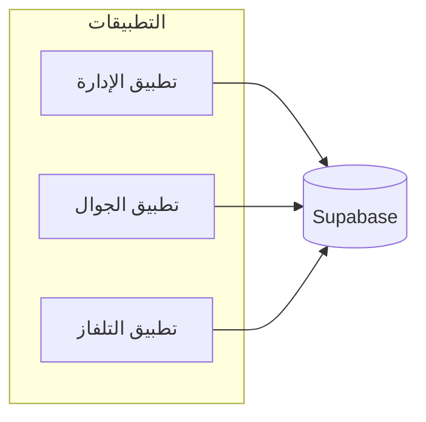
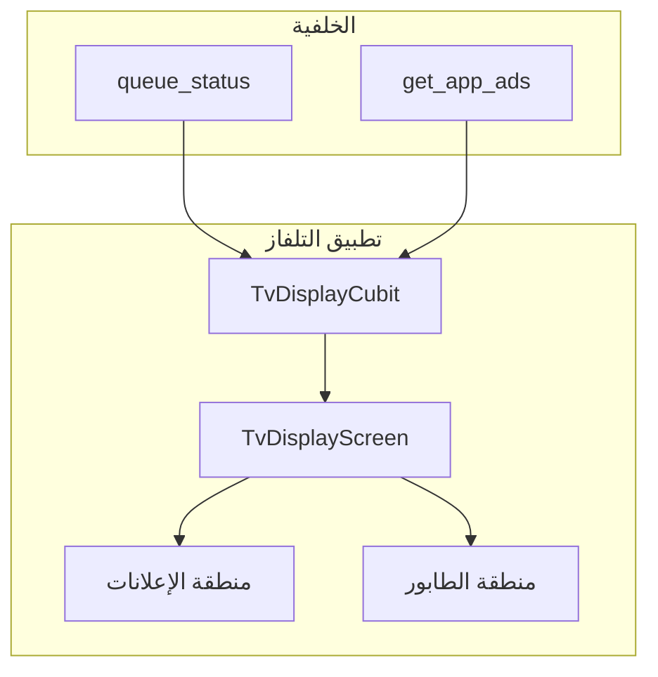

# شرح النظام وتطبيق شاشة التلفاز — موجز لتصميم UI/UX

هذا الملف يشرح نظام حجز العيادة وتطبيق شاشة التلفاز بالتفصيل، ويهدف إلى تقديمه لذكاء اصطناعي لتنفيذ تصميم UI/UX احترافي لتطبيق التلفاز.

---

## 1. نظرة عامة على النظام

### اسم المشروع
**نظام حجز عيادة أسنان (Dentist Booking)**

### مكوّنات النظام
النظام يتكون من ثلاثة تطبيقات Flutter تعمل مع نفس الخلفية (Supabase):

| التطبيق | الوصف |
|--------|--------|
| **تطبيق الإدارة (Admin)** | لوحة تحكم ويب/سطح مكتب — إدارة المرضى، الموظفين، الحجوزات، الطابور، الإعلانات، الإعدادات، دخول موظفين. |
| **تطبيق الجوال (App)** | للمرضى — الصفحة الرئيسية، الحجز، تتبع الطابور برمز التذكرة، الملف الشخصي، دعم الضيوف، دعم العربية والإنجليزية. |
| **تطبيق التلفاز (TV)** | يعرض على شاشة في صالة انتظار العيادة — إعلانات/بانرات + حالة الطابور (الرقم الحالي، التالي، عدد المنتظرين). |

### مصدر البيانات
- **Supabase** (PostgreSQL + دوال RPC مثل `queue_status`, `get_app_ads`) هو المصدر الموحد للبيانات لجميع التطبيقات.

---

## 2. تطبيق شاشة التلفاز — التفاصيل التقنية والوظيفية

### الغرض
عرض معلومات للمرضى الجالسين في صالة انتظار العيادة **بدون تفاعل مستخدم** — الشاشة للعرض فقط (Display Only).

### المستخدمون
المرضى في صالة الانتظار الذين يشاهدون الشاشة **من بُعد** (عدة أمتار).

### المنصة والتوجيه
- **Flutter** — يعمل على أجهزة TV (مثل Android TV) أو أي جهاز يعرض واجهة التلفاز.
- **الاتجاه ثابت: أفقي (Landscape)** فقط.

### تدفق البيانات في تطبيق التلفاز

### مراجع الكود (للمطورين)
| الملف | الوظيفة |
|------|----------|
| `lib/features/display/screens/tv_display_screen.dart` | الشاشة الرئيسية الوحيدة. |
| `lib/features/display/widgets/ads_carousel_tv.dart` | عرض البانر/الإعلانات (كاروسيل). |
| `lib/features/display/widgets/queue_display_tv.dart` | عرض حالة الطابور. |
| `lib/features/display/blocs/tv_display_state.dart` | حالات الواجهة (تحميل، محتوى، خطأ). |
| `lib/core/model/queue_status_model.dart` | نموذج بيانات الطابور. |
| `lib/core/model/ads_model.dart` | نموذج بيانات الإعلانات. |

---

## 3. المحتوى المعروض على الشاشة

### التخطيط الحالي (Layout)
- **أعلى الشاشة (الجزء الأكبر — flex 5)**: منطقة الإعلانات (كاروسيل).
- **أسفل الشاشة (flex 2)**: منطقة الطابور (الرقم الحالي + معلومات إضافية).

### منطقة الإعلانات
- **المصدر**: دالة RPC `get_app_ads` — كل إعلان قد يحتوي على `images` (قائمة روابط صور) أو `link_url` (رابط صورة واحد).
- **السلوك**: كاروسيل يمر تلقائياً كل **5 ثوانٍ**، مع نقاط مؤشر (dots) أسفل الكاروسيل.
- **حالة خاصة**: إن لم يوجد إعلانات — عرض رسالة **"لا توجد إعلانات"**.

### منطقة الطابور
- **المصدر**: دالة RPC `queue_status` مع المعامل `p_datetime` (الوقت الحالي).

#### في الوضع العادي (state = NORMAL)
| العنصر | الوصف |
|--------|--------|
| عنوان | "الرقم الحالي" |
| الرقم الرئيسي | إذا `current_queue_number == 0`: **«الطابور لم يبدأ»**؛ وإلا الرقم بشكل كبير (مثل 0042) مع padding. عند وجود رقم حالي: **«يرجى التوجه إلى الطبيب»** (+ `CLINIC_DOCTOR_NAME` اختياري). |
| التالي | من `next_booking.queue_number` — يظهر في شريط جانبي بعنوان "التالي". |
| في الانتظار | `waiting_count` — عدد المنتظرين، يظهر في شريط جانبي بعنوان "في الانتظار". |

#### عند عدم العمل العادي — رسائل حسب الحالة
| الحالة (state) | الرسالة المعروضة |
|----------------|------------------|
| CLOSED | العيادة مغلقة اليوم |
| PAUSED | الطابور متوقف مؤقتاً |
| OUT_OF_WORKING_HOURS | خارج أوقات العمل |
| NO_MORE_BOOKINGS_MORNING | لا مزيد من الحجوزات — الفترة الصباحية |
| NO_MORE_BOOKINGS_EVENING | لا مزيد من الحجوزات — الفترة المسائية |
| غير ذلك | لا توجد بيانات طابور |

### إعلان صوتي وشاشة منبثقة (متزامنان)
- عند زيادة `current_queue_number` — بما فيها **من 0 إلى 1** عند بدء الطابور (`NORMAL` أو `NO_MORE_BOOKINGS_*` مع رقم حالي لآخر مريض): overlay + TTS **مرة واحدة** من [`CalledNumberOverlay`](lib/features/display/widgets/called_number_overlay.dart). يُحفظ آخر رقم حتى عند `0` لاكتشاف البدء.
- التسلسل: دخول (~0.5s) → صوت **«صاحب الدور {N} يرجى التوجه إلى مكتب الطبيب»** → انتظار قصير (~1.5s) → خروج (~0.4s).
- `.env`: `TV_ANNOUNCEMENT_ENABLED`، `TV_OVERLAY_HOLD_AFTER_SPEECH_MS` (1500)، `TV_OVERLAY_HOLD_WHEN_SILENT_MS` (5000 عند تعطيل الصوت).
- يتطلب محرك TTS عربي على جهاز Android TV.

### تحديث البيانات
- **Realtime** على `bookings` و `queue_state` مع debounce ثم RPC `queue_status`؛ fallback poll كل 60 ثانية للحجوزات؛ إعلانات كل 5 دقائق.

### حالات الواجهة (UI States)
| الحالة | السلوك |
|--------|--------|
| تحميل أولي / تحميل | عرض `CircularProgressIndicator` في المنتصف. |
| محتوى جاهز (Loaded) | عرض الإعلانات + منطقة الطابور كما سبق. |
| خطأ (Error) | عرض رسالة الخطأ في المنتصف بلون الخطأ. |

---

## 4. موجز التصميم لذكاء اصطناعي (UI/UX)

هذا القسم مخصّص لاستخدامه كـ **prompt** أو موجز تقديمه لذكاء اصطناعي لتصميم واجهة مستخدم واحترافية لتطبيق شاشة التلفاز.

---

### السياق
- **البيئة**: عيادة أسنان — شاشة عرض ثابتة في **صالة انتظار**.
- **المشاهدون**: المرضى الجالسون في الصالة — المشاهدة من **بُعد** (عدة أمتار).
- **طريقة الاستخدام**: **لا تفاعل مستخدم** — الشاشة للعرض فقط (Display Only)، لا ضغطات ولا إدخال.

### اللغة والاتجاه
- **اللغة**: العربية.
- **الاتجاه**: **RTL** (من اليمين لليسار). جميع النصوص الحالية في التطبيق بالعربية.

### القيود التقنية
- **الاتجاه**: أفقي (Landscape) فقط.
- **المنصة**: شاشة كبيرة (TV) — غالباً دقة عالية وعرض كبير.
- **الإطار**: Flutter مع **Material Design 3**.
- **الخط الحالي**: IBM Plex Sans Arabic (قابل للتغيير في التصميم المقترح).

### أولويات التصميم
1. **وضوح الرقم الحالي للطابور من بُعد**: أن يكون الرقم الحالي (مثل 0042) واضحاً جداً — حجم خط كبير، تباين عالٍ، خلفية أو إطار يساعد على القراءة السريعة.
2. **قراءة سريعة لمعلومات "التالي" و"في الانتظار"**: أن تكون هذه المعلومات secondary لكن مقروءة من بُعد.
3. **عدم إرباك المشاهد**: فصل واضح بين منطقة الإعلانات (أعلى) ومنطقة الطابور (أسفل) — منطقة الطابور يجب أن تبقى مستقرة وسهلة المتابعة.
4. **احترافية تناسب بيئة طبية**: ألوان وتنسيق هادئ، مناسب لعيادة أسنان، دون إبهار أو تشتيت.

### المطلوب من المصمم (أو الذكاء الاصطناعي)
- اقتراح **تخطيط (Layout)** احترافي: توزيع منطقة الإعلانات مقابل منطقة الطابور (نسب، مسافات، تسلسل بصري) مع مراعاة الشاشة الأفقية الكبيرة.
- اقتراح **ألوان وتباين وأسلوب بصري (ثيم)** يناسب العيادة ويحسّن القراءة من بُعد.
- تحسين **عرض الرقم الحالي** للطابور: حجم، وزن، لون، خلفية، إطار — ليكون العنصر الأبرز في منطقة الطابور.
- تحسين **شكل الكاروسيل** (الإعلانات) والمؤشرات (dots) ليكون أنيقاً ومتناسقاً مع بقية الواجهة.
- معالجة **حالات خاصة**: لا إعلانات، رسائل الطابور (مغلق، متوقف، خارج أوقات العمل، لا مزيد من الحجوزات)، وشاشة الخطأ — بحيث تبقى الواجهة واضحة وغير مخيفة للمريض.
- ضمان **توافق التصميم مع RTL والعربية** في كل العناصر.

### ملخص المحتوى الذي يجب أن تعرضه الواجهة
- **أعلى**: كاروسيل إعلانات (صور من الإدارة) — أو رسالة "لا توجد إعلانات".
- **أسفل**:  
  - إما: عنوان "الرقم الحالي" + رقم كبير + صف يحتوي "التالي" و"في الانتظار".  
  - أو: رسالة واحدة حسب حالة الطابور (مغلق، متوقف، خارج أوقات العمل، إلخ).

---

*تم إعداد هذا الموجز لاستخدامه كمدخل لذكاء اصطناعي أو مصمم لواجهة تطبيق شاشة التلفاز ضمن نظام حجز العيادة.*
