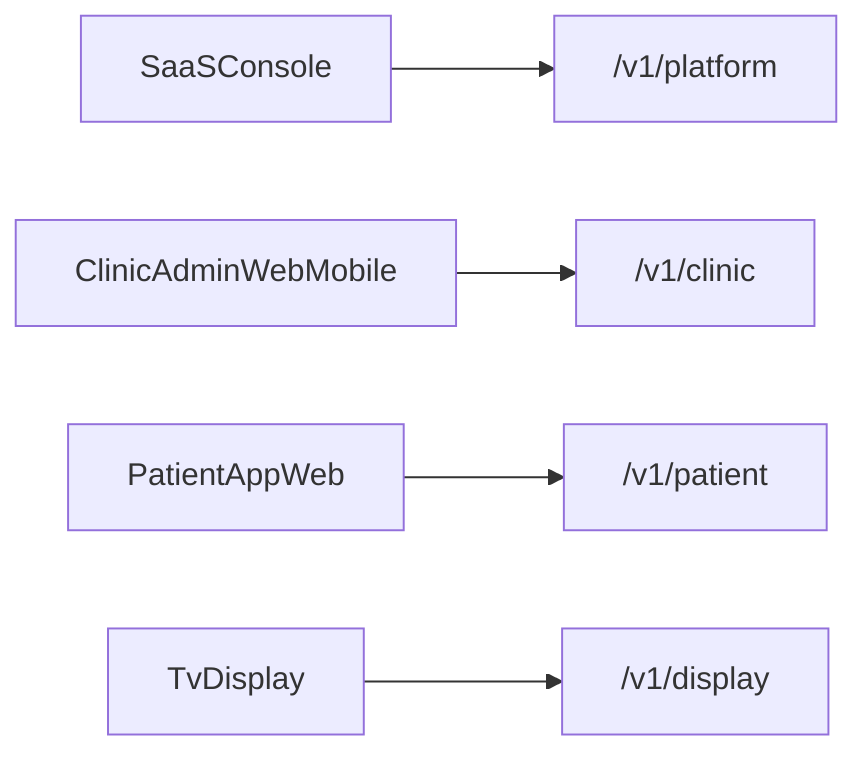

# SaaS Clinic Booking API — Documentation Pack

> حزمة مواصفات معمارية (بدون كود) لبناء API موحّد لمنصة SaaS متعددة العيادات لحجز المواعيد.

## الغرض

تمكين AI agent (أو فريق تطوير) من بناء API احترافي يغطي:

- تسجيل العيادات والاشتراك والدفع والتفعيل
- تشغيل كل عيادة (حجز، طابور، موظفون، إعدادات، إعلانات)
- قنوات المريض والشاشة
- إدارة المنصة

**لا تتضمن هذه الحزمة كوداً ولا اختيار إطار تنفيذ.**

## ترتيب القراءة الإلزامي

1. [01-product-vision.md](./01-product-vision.md) — ماذا نبني ولمن والقنوات
2. [02-tenancy-billing.md](./02-tenancy-billing.md) — العزل والاشتراك والفوترة
3. [03-domain-model.md](./03-domain-model.md) — الكيانات والقواعد
4. [05-auth-roles-ops.md](./05-auth-roles-ops.md) — الهوية والصلاحيات لكل قناة
5. [06-cross-cutting-conventions.md](./06-cross-cutting-conventions.md) — اصطلاحات الـ API العرضية
6. [04-api-surface.md](./04-api-surface.md) — endpoints مفصولة حسب القناة

ثم العودة لهذا الملف لقائمة التحقق وـ Prompt pack.

## دور كل ملف

| ملف | الدور |
|-----|------|
| [`00-README.md`](./00-README.md) | الفهرس، glossary، checklist، تعليمات الوكيل |
| [`01-product-vision.md`](./01-product-vision.md) | الرؤية، الأطراف، القنوات الأربع، تتبع الحالي→SaaS |
| [`02-tenancy-billing.md`](./02-tenancy-billing.md) | tenant، خطط، entitlements، دفع، dunning، دورة حياة |
| [`03-domain-model.md`](./03-domain-model.md) | نموذج المجال، الحالات، قواعد الحجز/الطابور، timezone، احتفاظ |
| [`04-api-surface.md`](./04-api-surface.md) | أربعة أسطح endpoints: platform / clinic / patient / display |
| [`05-auth-roles-ops.md`](./05-auth-roles-ops.md) | مصادقة وأدوار ودعوات وتدقيق وإدارة منصة |
| [`06-cross-cutting-conventions.md`](./06-cross-cutting-conventions.md) | أخطاء، pagination، idempotency، webhooks، NFR |

## قرار جوهري: فصل القنوات

API واحد، أربعة أسطح مسارات **لا تُخلط**:

| القناة | البادئة | المستهلك |
|--------|---------|----------|
| Platform | `/v1/platform/...` | لوحة تحكم SaaS |
| Clinic | `/v1/clinic/...` | لوحة العيادة + تطبيق الأدمن |
| Patient | `/v1/patient/...` | صفحة ويب الحجز + تطبيق المرضى |
| Display | `/v1/display/...` | شاشة غرفة الانتظار (TV) |

**قاعدة للوكيل:** لا تضع عمليات Clinic (مثل تحكم الطابور) تحت Patient أو Display. لوحة العيادة وتطبيق الأدمن = قناة Clinic واحدة.



## قرارات مفروضة أخرى

- العزل التشغيلي بمفتاح `clinic_id` في كل مورد خاص بالعيادة
- المعرّف العام للعيادة: `slug` فريد
- لا ذكر لتقنية تنفيذ (.NET / قاعدة بيانات معينة / SDK) داخل المواصفات
- النظام الحالي أحادي العيادة هو مصدر الحقيقة الوظيفي قبل التعميم
- التشغيل مربوط بحالة اشتراك تسمح بالوصول (انظر `02`)

## Glossary

| مصطلح | المعنى |
|--------|--------|
| Platform | مالكو SaaS وإدارة المنصة |
| Clinic / Tenant | عيادة مشتركة في المنصة |
| `clinic_id` | مفتاح عزل بيانات العيادة |
| `slug` | معرّف عام للصفحة/الحجز العام |
| Channel / Surface | أحد الأسطح الأربعة للـ API |
| Entitlement | ميزة أو حد ضمن خطة الاشتراك |
| Display device | جهاز TV مربوط بعيادة |
| Guest booking | حجز باسم زائر بدون حساب مريض كامل |
| Dunning | سلسلة تذكير/مهل بعد فشل التحصيل |
| Idempotency-Key | مفتاح لمنع تكرار عمليات الإنشاء الحساسة |
| Grace | مهلة بعد تعثر الدفع قبل التعليق الكامل |

## Out of scope

- كود، SDK، ORM، تفاصيل إطار الخادم
- تصميم واجهات المستخدم
- اختيار مزوّد دفع بالاسم (يُوصف مفاهيمياً فقط: Checkout / Invoice / Webhook)
- شهادات امتثال طبية رسمية (يُغطى PII/احتفاظ فقط في `03`)

## Agent checklist

قبل اعتبار المواصفات «قابلة للتنفيذ» وللتحقق بعد التنفيذ المفاهيمي:

- [x] القنوات الأربع موثّقة ببادئات منفصلة (`04`)
- [x] لا endpoint كتابة حساس مشترك بين Clinic وPatient/Display (`04` خريطة القناة)
- [x] كل مورد تشغيلي يرتبط بـ `clinic_id` (`02`, `03`)
- [x] حالات الاشتراك ودورة dunning موثّقة (`02`)
- [x] قواعد الحجز/الطابور منقولة من النظام الحالي مع التعميم (`03`)
- [x] نموذج أخطاء + pagination + idempotency موثّق (`06`)
- [x] كتالوج أحداث/webhooks موجود (`06`)
- [x] مصفوفة أدوار × قناة × صلاحيات موجودة (`05`)
- [x] جدول تتبع الحالي → SaaS موجود (`01`)
- [x] Timezone لكل عيادة وسياسة احتفاظ PII (`03`)

## Prompt pack للـ AI agent

انسخ عند بدء التنفيذ:

```
You are implementing a multi-tenant Clinic Booking SaaS API from architecture docs only.

Rules:
1. Read docs in order: 01 → 02 → 03 → 05 → 06 → 04.
2. One API host; four path surfaces: /v1/platform, /v1/clinic, /v1/patient, /v1/display.
3. Never mix channel contracts (e.g. queue control only under /v1/clinic).
4. Clinic admin web and clinic admin mobile share /v1/clinic only.
5. Enforce clinic_id isolation on all clinic-scoped resources; public discovery uses slug.
6. Do not invent features missing from the docs; ask only if a requirement is truly unspecified.
7. Specs are technology-agnostic; choose stack only when asked separately.
8. Preserve booking/queue business rules from 03-domain-model.md.
9. Enforce subscription access states from 02-tenancy-billing.md before write operations.
10. Apply cross-cutting rules from 06 (errors, pagination, idempotency, rate limits per channel).
```

## حالة الحزمة

**مكتملة للمرحلة الأولى من المواصفات المعمارية** — جاهزة للتسليم لـ AI agent لبناء الـ API.
