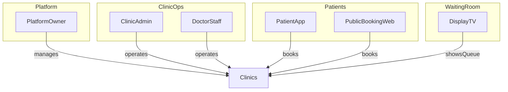
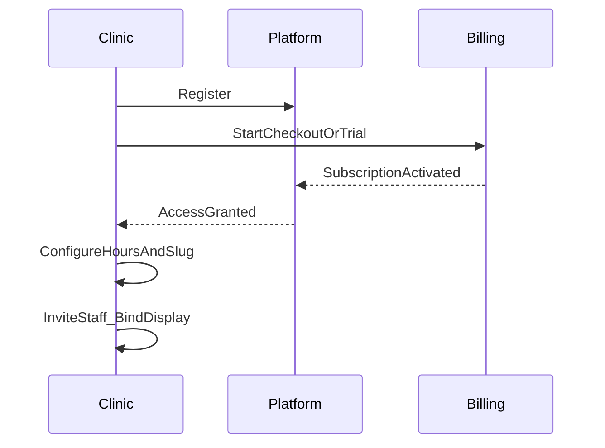

# 01 — Product Vision

## الغرض والنطاق

يصف هذا الملف ماذا تبني المنصة، لمن، وأي قنوات تستهلك الـ API. لا يصف endpoints بالتفصيل (انظر `04`).

## قرارات مفروضة

- المنصة SaaS متعددة العيادات على API واحد
- أربع قنوات استهلاك منفصلة للعقود: Platform، Clinic، Patient، Display
- القدرات الوظيفية مستمدة من النظام الحالي أحادي العيادة ثم تُعمَّم

## الأطراف (Actors)

| الطرف | الوصف |
|-------|--------|
| Platform Owner / Support | يدير العيادات والخطط والاشتراكات والدعم |
| Clinic Admin | يدير تشغيل العيادة بالكامل |
| Doctor / Staff | تشغيل يومي (حجوزات، طابور) ضمن صلاحيات محدودة |
| Patient | يحجز ويتتبع مواعيده عبر التطبيق أو صفحة العيادة |
| Guest | يُحجز له بدون حساب كامل (عبر العيادة أو مسار حجز-لآخر) |
| Display Device | يعرض الطابور والإعلانات في غرفة الانتظار |

## القنوات الأربع

| القناة | المستهلكون | المسؤولية |
|--------|------------|-----------|
| Platform | لوحة تحكم SaaS | Onboarding العيادات، الخطط، الفوترة، المراقبة، الدعم |
| Clinic | لوحة ويب/ديسكتوب + تطبيق أدمن موبايل | تشغيل العيادة: حجوزات، طابور، موظفون، إعدادات، إعلانات، اشتراك ذاتي |
| Patient | صفحة ويب عامة للعيادة + تطبيق المرضى | توفر، حجز ذاتي، إلغاء ذاتي، تتبع تذكرة، إعلانات التطبيق |
| Display | تطبيق TV | عرض حالة الطابور وإعلانات الشاشة فقط |

## رحلة العيادة (عالية المستوى)

1. تسجيل عيادة جديدة (بيانات أساسية + مالك)
2. اختيار خطة وبدء checkout / trial
3. تأكيد الدفع أو انتهاء تفعيل التجربة
4. تفعيل الاشتراك → السماح بتشغيل القنوات Clinic / Patient / Display
5. إعداد ساعات العمل والسعة والـ slug
6. دعوة موظفين وربط جهاز العرض
7. استقبال حجوزات وتشغيل الطابور يومياً
8. تجديد/تعثر دفع/تعليق/إلغاء حسب دورة الفوترة

## حالي vs SaaS

| البعد | النظام الحالي | الهدف SaaS |
|-------|---------------|------------|
| عدد العيادات | عيادة واحدة | آلاف العيادات على API واحد |
| الإعدادات | صف إعدادات وحيد | إعدادات لكل `clinic_id` |
| التسجيل | مستخدمون داخل عيادة واحدة | تسجيل عيادة + اشتراك + منصة |
| الصفحة العامة | غير موجودة كمنتج منفصل | صفحة/مسار Patient لكل `slug` |
| إدارة المنصة | غير موجودة | سطح Platform كامل |

## Traceability — الحالي → SaaS

| قدرة حالية | قناة SaaS | ملاحظة |
|------------|-----------|--------|
| حجز أدمن / ضيف | Clinic | مع `clinic_id` |
| حجز مريض ذاتي | Patient | قواعد السعة والوقت |
| إلغاء مريض | Patient | ذاتي فقط |
| قائمة حجوزات مفلترة | Clinic | ليست مواعيدي |
| مواعيدي / نطاق تاريخ | Patient | عقد منفصل |
| طابور next/pause/resume/restart | Clinic فقط | ممنوع على Patient/Display |
| حالة طابور للعرض | Display (+ قراءة Clinic) | Display بلا تحكم |
| إعدادات وساعات العمل | Clinic | لكل عيادة |
| موظفون ومرضى | Clinic | عزل بالمستأجر |
| إعلانات all/app/tv | Clinic إدارة؛ Patient/Display استهلاك | حسب audience |
| لوحة إحصائيات | Clinic | لاحقاً ملخصات Platform |
| بوابة إصدارات التطبيقات | Platform + كل عميل | حدود دنيا اختيارية لكل قناة |
| اشتراك/دفع | Platform + Clinic self-service | جديد بالكامل |

## مبادئ المنتج

- عزل صارم بين العيادات
- عقود API واضحة لكل قناة
- الاشتراك الفعّال شرط التشغيل (مع trial موثّق)
- قواعد الحجز العادلة للمرضى مع تجاوز مضبوط للأدمن/الموظف داخل العيادة

## حالة الملف

مكتمل كمرجع رؤية وقنوات وتتبع قدرات.
