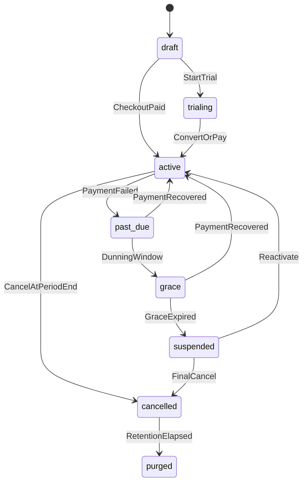
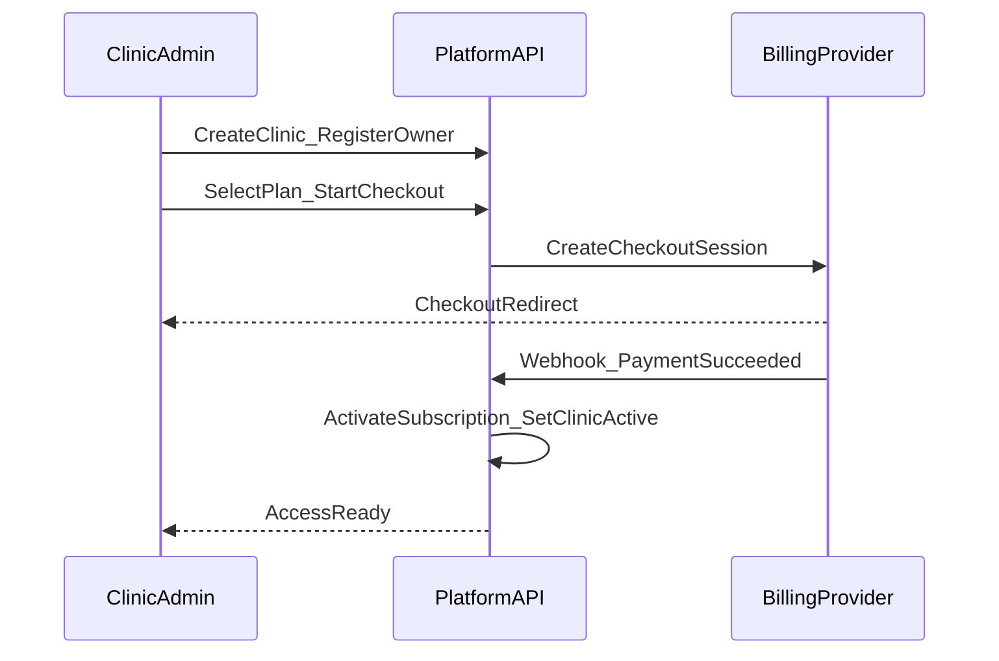

# 02 — Tenancy & Billing

## الغرض والنطاق

يعرّف عزل المستأجرين، خطط الاشتراك، entitlements، الدفع، dunning، ودورة حياة العيادة. لا يصف تفاصيل الحجز التشغيلية (انظر `03`).

## قرارات مفروضة

- كل عيادة = tenant واحد يُعرَّف بـ `clinic_id`
- المعرّف العام للصفحة: `slug` فريد عالمياً
- التشغيل عبر Clinic/Patient/Display يتطلب اشتراكاً في حالة تسمح بالوصول (active أو trial؛ وgrace محدودة حسب الجدول)
- الفوترة مفاهيمية: Checkout Session / Invoice / Webhook — بدون تسمية مزوّد

## نموذج المستأجر (Clinic)

| الحقل المفاهيمي | الوصف |
|-----------------|--------|
| `clinic_id` | معرّف داخلي ثابت |
| `slug` | معرّف عام فريد لمسارات Patient/Display العامة |
| `name` | الاسم التجاري |
| `timezone` | منطقة زمنية للعيادة (إلزامي) |
| `status` | حالة تشغيل المستأجر (انظر أدناه) |
| `owner_user_id` | مالك العيادة الأولي |

### حالات العيادة (Tenant lifecycle)

| الحالة | المعنى | وصول القنوات |
|--------|--------|--------------|
| `draft` | مسجّلة قبل اكتمال التفعيل | Platform فقط لإكمال الإعداد |
| `trialing` | فترة تجريبية | Clinic/Patient/Display مسموح ضمن حدود الخطة |
| `active` | اشتراك ساري | كامل حسب entitlements |
| `past_due` | تعثر دفع حديث | وصول كامل لفترة قصيرة مع تنبيهات |
| `grace` | مهلة بعد past_due | Clinic للقراءة+تشغيل محدود؛ Patient قد يُقيَّد للحجز الجديد حسب السياسة أدناه |
| `suspended` | معلّقة لعدم الدفع أو إدارياً | Clinic قراءة فقط؛ Patient/Display بلا حجز جديد؛ Display قد يعرض رسالة إيقاف |
| `cancelled` | ملغاة | لا تشغيل؛ بيانات محتفظ بها حسب سياسة الاحتفاظ |
| `purged` | محذوفة منطقياً بعد الاحتفاظ | لا وصول تشغيلي |

**سياسة الحجز أثناء grace:** يُسمح بإكمال الحجوزات القائمة وعرض الطابور؛ **إنشاء حجز جديد من Patient يُرفض**؛ Clinic قد يُنشئ حجوزات طارئة إذا سمحت الخطة (افتراض الخطة: مسموح لـ admin فقط أثناء grace).

## الخطط (Plans)

| مفهوم | الوصف |
|-------|--------|
| Plan | عرض تجاري (اسم، دورة شهر/سنة، سعر مفاهيمي) |
| Entitlement | ميزة أو حد رقمي مرتبط بالخطة |
| Subscription | ربط عيادة بخطة + حالة + فترة حالية |

### مصفوفة Entitlements (افتراض أولي للوثائق)

| Entitlement | Starter | Growth | Enterprise |
|-------------|---------|--------|------------|
| `max_staff_users` | 3 | 15 | unlimited |
| `max_display_devices` | 1 | 3 | unlimited |
| `patient_app_enabled` | yes | yes | yes |
| `public_booking_web_enabled` | yes | yes | yes |
| `tv_display_enabled` | yes | yes | yes |
| `announcements_enabled` | limited | yes | yes |
| `morning_capacity_cap` | plan max | plan max | custom |
| `evening_capacity_cap` | plan max | plan max | custom |
| `platform_priority_support` | no | no | yes |

القيم الرقمية الدقيقة للسعة تُضبط على مستوى إعدادات العيادة **ولا تتجاوز** سقف الخطة.

## الاشتراك (Subscription states)

| الحالة | الوصف |
|--------|--------|
| `trialing` | تجريبي |
| `active` | مدفوع وساري |
| `past_due` | فشل تحصيل |
| `grace` | مهلة تحصيل |
| `paused` | إيقاف اختياري نادر (إن فُعّل إدارياً) |
| `cancelled` | ملغى |
| `expired` | انتهت دون تجديد |

## تدفق الدفع والتفعيل

مفاهيم واجهة الفوترة:

- `CheckoutSession` — بدء دفع/ترقية
- `Invoice` — فاتورة لفترة
- `PaymentWebhook` — حدث مزوّد يُترجم لحالة اشتراك
- `CustomerPortal` (اختياري) — إدارة وسيلة الدفع ذاتياً من Clinic

## Dunning (تذكير التحصيل)

1. فشل دفع → `past_due` + إشعار للمالك
2. محاولات إعادة تحصيل مجدولة (مفاهيمياً)
3. الانتقال إلى `grace` مع تقييد Patient للحجوزات الجديدة
4. انتهاء المهلة → `suspended`
5. استعادة الدفع → العودة إلى `active`

## من يدير ماذا

| العملية | Platform | Clinic self-service |
|---------|----------|---------------------|
| إنشاء خطة | نعم | لا |
| تغيير أسعار الخطة | نعم | لا |
| تسجيل عيادة | نعم (أو مسار تسجيل عام يُنشئ عبر Platform APIs) | بداية التسجيل |
| اختيار/ترقية خطة | مراقبة | نعم |
| تعليق إداري | نعم | لا |
| إلغاء اشتراك | نعم | نعم (نهاية الفترة) |

## عزل البيانات

- كل موارد التشغيل (حجوزات، طابور، موظفون، مرضى، إعدادات، إعلانات، أجهزة عرض) تحمل `clinic_id`
- استعلامات Clinic/Patient/Display تُقيَّد دائماً بمستأجر السياق
- Platform يمكنه سرد العيادات عبر سطحه فقط؛ أي دخول بيانات تشغيلية للدعم يجب أن يكون عبر endpoints منصة صريحة ومُدقَّقة

## حالة الملف

مكتمل كمرجع tenancy وbilling وentitlements.
