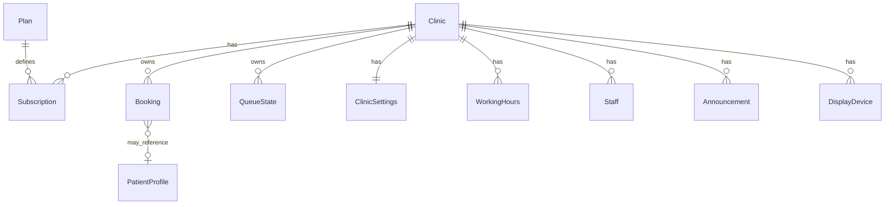
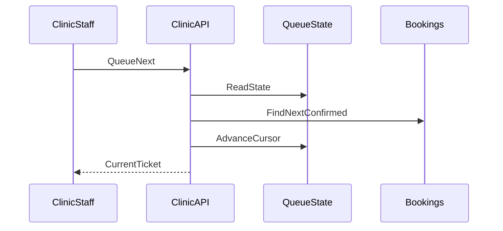

# 03 — Domain Model

## الغرض والنطاق

يعرّف الكيانات، الحالات، العلاقات، وقواعد الحجز والطابور بعد تعميم النظام الحالي إلى multi-tenant. المصدر الوظيفي: نظام الحجز أحادي العيادة الحالي.

## قرارات مفروضة

- كل كيان تشغيلي مرتبط بـ `clinic_id` (ما عدا كيانات المنصة: Plan، ومستخدم منصة)
- التواريخ والأوقات تُفسَّر حسب `clinic.timezone`
- الورديات: `morning` و `evening` فقط
- أرقام الطابور أحادية الاتجاه لليوم+الوردية (لا إعادة استخدام ضمن اليوم)

## كيانات المنصة (Platform-scoped)

| كيان | الوصف |
|------|--------|
| PlatformUser | مستخدم لوحة SaaS |
| Plan | خطة اشتراك |
| PlanEntitlement | حدود/ميزات الخطة |
| Clinic | المستأجر |
| Subscription | اشتراك العيادة |
| Invoice | فاتورة |
| AuditEvent | سجل تدقيق (منصة أو عيادة) |

## كيانات العيادة (Clinic-scoped)

| كيان | الوصف |
|------|--------|
| ClinicUser / Profile | مستخدم مرتبط بالعيادة (admin/doctor/staff/patient) |
| Staff | بطاقة موظف مرتبطة بالملف |
| StaffInvite | دعوة موظف |
| PatientProfile | مريض مسجّل |
| Booking | موعد |
| QueueState | مؤشر الطابور لكل وردية |
| ClinicSettings | إعدادات السعة والحجز |
| WorkingHours | ساعات لكل يوم أسبوع |
| Announcement | إعلان/إعلان ترويجي |
| DisplayDevice | جهاز TV مربوط |
| Ticket | مفهوم مشتق: `ticket_code` + `queue_number` على الحجز |

## تعدادات وحالات

### أدوار المستخدم داخل العيادة

`admin` | `doctor` | `staff` | `patient`

### حالة الحساب

`active` | `vacation` | `suspended` | `resigned` | `terminated` | `inactive` | `banned` | `paused` | `appMaintenance`

### وردية الحجز

`morning` | `evening`

### حالة الحجز

`pending` | `confirmed` | `completed` | `cancelledByPatient` | `cancelledByStaff` | `noShow`

### نوع المريض على الحجز

`registered` | `guest`

### جمهور الإعلان

`all` | `appOnly` | `tvOnly`

### منصب الموظف (اختياري تشغيلي)

nurse | receptionist | assistant | technician | cleaner | manager

## قواعد الحجز (Business rules)

تُطبَّق داخل نطاق `clinic_id` وتُقيَّم بتوقيت العيادة.

### نوافذ الوقت (للمرضى عبر قناة Patient)

- اليوم يجب أن يكون مفتوحاً في `WorkingHours.is_open`
- الوردية يجب أن تكون مفتوحة (`morning_is_open` / `evening_is_open`)
- الحجز ممكّن عالمياً للعيادة (`is_booking_enabled`) وإلا سبب الإيقاف
- الصباح: من `booking_morning_start_time` حتى `morning_end - allow_before_minutes`
- المساء: حتى `evening_end - allow_before_minutes` وفق نفس منطق النظام الحالي
- أسباب فشل شائعة: `day_not_exist`, `clinic_closed`, `morning_closed`, `evening_closed`, `too_early_*`, `too_late_*`, `booking_disabled`

### السعة

- حدود: `morning_count_limit` / `evening_count_limit` (لا تتجاوز سقف الخطة)
- تُحسب الحجوزات غير الملغاة لليوم+الوردية
- أسباب: `morning_full` / `evening_full`

### الضيف vs المسجّل

- `registered`: يتطلب `patient_id` واسم قابل للحل
- `guest`: يتطلب `guest_name` غير فارغ (هاتف/عنوان اختياري)
- عرض الأسماء يفضّل حقول الضيف عند وجودها

### قاعدة الحجز الذاتي لليوم

- إذا كان المسار «ذاتي» (بدون اسم ضيف لآخر): مسموح حجز واحد فقط بحالة pending/confirmed لنفس المريض في نفس اليوم → `already_has_self_booking_today`
- الحجز لشخص آخر/ضيف بـ `guest_name` مسار منفصل

### تجاوز Clinic staff/admin

- مستخدمو Clinic ذوو صلاحية التشغيل يمكنهم تجاوز قيود الوقت/الإغلاق/السعة/تعطيل الحجز كما في النظام الحالي
- لا يتجاوزون: عزل `clinic_id`، ولا قواعد الاسم المطلوبة، ولا قيود الاشتراك المعلّق حسب سياسة الفوترة

### الحالة عند الإنشاء

- Patient ينشئ عادة `pending`؛ إن `auto_confirm` في إعدادات العيادة → يُثبَّت `confirmed`
- Clinic يحدد الحالة ضمن المسموح

### رقم الطابور والتذكرة

- عند الإنشاء: `queue_number = max(existing for day+shift) + 1`
- `ticket_code` فريد ضمن العيادة (أو عالمياً إن رُغب؛ الافتراض: فريد لكل `clinic_id`)
- لا إعادة استخدام أرقام ملغاة ضمن نفس اليوم+الوردية

## قواعد الطابور

- `QueueState` لكل عيادة ولكل وردية: `current_queue_number`, `is_paused`, `updated_at`
- التقدم (`next`) يمر على الحجوزات `confirmed` فقط
- عمليات التحكم (`next`, `pause`, `resume`, `restart`) **قناة Clinic فقط**
- Display يقرأ الحالة ويعرض الرقم الحالي والإعلانات
- إعادة ضبط مؤشر اليوم عند يوم تقويمي جديد بتوقيت العيادة
- يمكن استمرار استدعاء المرضى بعد انتهاء نافذة الحجز حتى تفريغ الطابور

## الإعدادات وساعات العمل

`ClinicSettings` (لكل عيادة): سعات، تفعيل الحجز، سبب الإيقاف، وقت بدء حجز الصباح، `allow_before_minutes`, `auto_confirm`, هاتف، ملاحظة التذكرة، حدود إصدارات اختيارية.

`WorkingHours`: يوم الأسبوع (نموذج الأسبوع المستخدم حالياً: سبت=1 … جمعة=7 أو ما يكافئه موثّقاً)، نوافذ صباح/مساء وأعلام الفتح.

## الإعلانات

- تُدار من Clinic
- تُستهلك من Patient حسب `appOnly`/`all`
- تُستهلك من Display حسب `tvOnly`/`all`

## أجهزة العرض

- `DisplayDevice` مربوط بـ `clinic_id`
- المصادقة عبر قناة Display (مفتاح جهاز / pairing) وليست جلسة موظف كاملة
- عدد الأجهزة محدود بـ entitlement الخطة

## Timezone

- كل مقارنة «اليوم»، «الآن»، نوافذ الحجز، وإعادة ضبط الطابور تستخدم `clinic.timezone`
- التخزين الموصى به مفاهيمياً: لحظات UTC + تفسير محلي بالمنطقة

## احتفاظ البيانات والخصوصية (PII)

| نوع البيانات | سياسة افتراضية |
|--------------|----------------|
| حجوزات نشطة/حديثة | تُحفظ طوال التشغيل |
| حجوزات قديمة | حذف منطقي أو أرشفة بعد مدة تحتفظ بها العيادة (افتراض وثائقي: 24 شهراً) |
| ملفات المرضى | حذف منطقي عند طلب العيادة/المالك مع الإبقاء على أثر تدقيق |
| عيادة `cancelled` | احتفاظ إلى `purged` (افتراض: 90 يوماً) |
| سجلات التدقيق | احتفاظ أطول (افتراض: 36 شهراً) |

لا تُدعى هنا شهادات امتثال طبية؛ المطلوب عزل، تقليل تعرض PII عبر القنوات، وحذف منطقي.

## Traceability

انظر جدول التتبع في `01-product-vision.md`؛ هذا الملف يفصّل القواعد المشار إليها هناك.

## حالة الملف

نموذج مجال كامل للاستخدام مع `04` و`05`.
