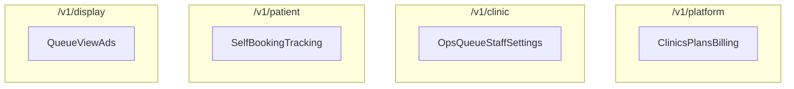

# 04 — API Surface (Channel-Separated)

## الغرض والنطاق

يسرد عقود الـ API **مفصولة حسب القناة**. التفاصيل العرضية (أخطاء عامة، pagination، idempotency) في `06`. الهوية في `05`. القواعد في `03`.

## قرارات مفروضة

- بادئات إلزامية:
  - Platform: `/v1/platform`
  - Clinic: `/v1/clinic`
  - Patient: `/v1/patient`
  - Display: `/v1/display`
- لا تُشارك endpoints الكتابة الحساسة بين القنوات
- لوحة العيادة وتطبيق الأدمن يستهلكان **Clinic فقط**
- كل مورد Clinic/Patient/Display التشغيلي ضمن سياق `clinic_id` (Patient/Display يحددان العيادة عبر slug أو ربط جهاز)

## اصطلاحات صف الـ endpoint

| العمود | المعنى |
|--------|--------|
| Method | فعل HTTP مفاهيمي |
| Path | تحت بادئة القناة |
| Auth | مطلوب / نوعه |
| Notes | Realtime أو قيود |

---

# A. Platform — `/v1/platform`

جمهور: مالكو المنصة والدعم.

## A1. Auth (منصة)

| Method | Path | Auth | Notes |
|--------|------|------|-------|
| POST | `/auth/login` | لا | جلسة منصة |
| POST | `/auth/logout` | نعم | |
| GET | `/auth/me` | نعم | |

## A2. Clinics

| Method | Path | Auth | Notes |
|--------|------|------|-------|
| GET | `/clinics` | نعم | قائمة + فلاتر حالة |
| GET | `/clinics/{clinic_id}` | نعم | تفاصيل + اشتراك ملخص |
| PATCH | `/clinics/{clinic_id}` | نعم | حالة إدارية، slug إن لزم |
| POST | `/clinics/{clinic_id}/suspend` | نعم | تدقيق إلزامي |
| POST | `/clinics/{clinic_id}/reactivate` | نعم | |
| GET | `/clinics/{clinic_id}/audit-events` | نعم | دعم |

## A3. Plans & Entitlements

| Method | Path | Auth | Notes |
|--------|------|------|-------|
| GET | `/plans` | نعم | |
| POST | `/plans` | نعم | owner |
| PATCH | `/plans/{plan_id}` | نعم | |
| PUT | `/plans/{plan_id}/entitlements` | نعم | مصفوفة الحدود |

## A4. Subscriptions & Invoices

| Method | Path | Auth | Notes |
|--------|------|------|-------|
| GET | `/subscriptions` | نعم | عبر العيادات |
| GET | `/subscriptions/{id}` | نعم | |
| POST | `/subscriptions/{id}/cancel` | نعم | إداري |
| GET | `/invoices` | نعم | |
| GET | `/invoices/{id}` | نعم | |

## A5. Billing webhooks (منصة)

| Method | Path | Auth | Notes |
|--------|------|------|-------|
| POST | `/billing/webhooks` | توقيع مزوّد | يحدّث الاشتراكات |

## A6. Monitoring (مختصر)

| Method | Path | Auth | Notes |
|--------|------|------|-------|
| GET | `/stats/overview` | نعم | أعداد عيادات/اشتراكات |
| GET | `/app-min-versions` | نعم | حدود إصدارات العملاء |
| PUT | `/app-min-versions` | نعم | |

### أخطاء مجال Platform شائعة

`clinic_not_found`, `plan_in_use`, `invalid_clinic_transition`, `forbidden_platform_role`

---

# B. Clinic — `/v1/clinic`

جمهور: admin / doctor / staff للعيادة. السياق: `clinic_id` من التوكن/العضوية.

## B1. Auth & session

| Method | Path | Auth | Notes |
|--------|------|------|-------|
| POST | `/auth/login` | لا | عضوية عيادة |
| POST | `/auth/logout` | نعم | |
| GET | `/auth/me` | نعم | دور + clinic + حالة حساب |
| POST | `/auth/refresh` | نعم | |

## B2. Staff invites & users

| Method | Path | Auth | Notes |
|--------|------|------|-------|
| GET | `/staff` | نعم | |
| POST | `/staff/invites` | admin | إنشاء دعوة |
| GET | `/staff/invites` | admin | |
| POST | `/staff/invites/{id}/revoke` | admin | |
| PATCH | `/staff/{staff_id}` | admin | |
| DELETE | `/staff/{staff_id}` | admin | منطقي |
| POST | `/staff/{staff_id}/password` | admin | تغيير كلمة مرور موظف |

قبول الدعوة قد يكون مساراً عاماً تحت Clinic أو Auth مشترك موثّقاً هنا:

| Method | Path | Auth | Notes |
|--------|------|------|-------|
| POST | `/staff/invites/accept` | توكن دعوة | يربط المستخدم بالعيادة |

## B3. Patients

| Method | Path | Auth | Notes |
|--------|------|------|-------|
| GET | `/patients` | نعم | بحث/صفحة |
| GET | `/patients/{patient_id}` | نعم | |
| PATCH | `/patients/{patient_id}` | نعم | حالة/meta ضمن الصلاحية |

## B4. Settings & working hours

| Method | Path | Auth | Notes |
|--------|------|------|-------|
| GET | `/settings` | نعم | إعدادات + ساعات |
| PUT | `/settings` | admin/doctor | يحترم سقف الخطة |

## B5. Bookings (تشغيل)

| Method | Path | Auth | Notes |
|--------|------|------|-------|
| GET | `/bookings` | نعم | فلاتر تاريخ/وردية/حالة/بحث |
| GET | `/bookings/{booking_id}` | نعم | |
| POST | `/bookings` | نعم | ضيف أو مسجّل؛ تجاوز قواعد مريض؛ **Idempotency-Key** |
| PATCH | `/bookings/{booking_id}` | نعم | تحديث/إلغاء موظف |
| DELETE | `/bookings/{booking_id}` | admin | إن كان مسموحاً في السياسة |

أخطاء مجال: نفس رموز `03` (`morning_full`, `patient_name_required`, …).

## B6. Queue control

| Method | Path | Auth | Notes |
|--------|------|------|-------|
| GET | `/queue/status` | نعم | Realtime اختياري |
| POST | `/queue/next` | نعم | |
| POST | `/queue/pause` | نعم | body: shift |
| POST | `/queue/resume` | نعم | |
| POST | `/queue/restart` | نعم | |

**هذه المجموعة ممنوعة خارج Clinic.**

## B7. Announcements

| Method | Path | Auth | Notes |
|--------|------|------|-------|
| GET | `/announcements` | نعم | |
| POST | `/announcements` | نعم | |
| PATCH | `/announcements/{id}` | نعم | |
| DELETE | `/announcements/{id}` | نعم | |

## B8. Display devices

| Method | Path | Auth | Notes |
|--------|------|------|-------|
| GET | `/display-devices` | نعم | |
| POST | `/display-devices/pairing-codes` | نعم | إنشاء رمز ربط |
| DELETE | `/display-devices/{id}` | نعم | |

## B9. Billing self-service

| Method | Path | Auth | Notes |
|--------|------|------|-------|
| GET | `/subscription` | admin | حالة الخطة |
| POST | `/subscription/checkout` | admin | ترقية/تجديد |
| POST | `/subscription/cancel` | admin | نهاية الفترة |
| GET | `/invoices` | admin | |

## B10. Dashboard

| Method | Path | Auth | Notes |
|--------|------|------|-------|
| GET | `/dashboard/stats` | نعم | إحصاءات العيادة |

### Realtime (Clinic)

الاشتراك في تيارات: حجوزات العيادة، `queue_state` للعيادة — لتحديث اللوحة والطابور.

---

# C. Patient — `/v1/patient`

جمهور: مرضى (جلسة) ومسارات حجز عامة محدودة عبر `slug`.

## C1. Clinic discovery

| Method | Path | Auth | Notes |
|--------|------|------|-------|
| GET | `/clinics/by-slug/{slug}` | لا | معلومات عامة آمنة فقط |
| GET | `/clinics/by-slug/{slug}/availability` | لا/محدود | توفر ورديات لتاريخ |

## C2. Auth (مريض)

| Method | Path | Auth | Notes |
|--------|------|------|-------|
| POST | `/auth/register` | لا | ضمن عيادة أو عام ثم ربط |
| POST | `/auth/login` | لا | |
| POST | `/auth/logout` | نعم | |
| GET | `/auth/me` | نعم | |
| PATCH | `/auth/me/profile` | نعم | |

## C3. Bookings (ذاتي)

| Method | Path | Auth | Notes |
|--------|------|------|-------|
| GET | `/bookings` | نعم | مواعيدي فقط |
| GET | `/bookings/{booking_id}` | نعم | ملكية فقط |
| POST | `/bookings` | نعم أو ضيف موثّق | قواعد مريض كاملة؛ **Idempotency-Key** |
| POST | `/bookings/{booking_id}/cancel` | نعم | إلغاء ذاتي فقط |

لا قائمة كل حجوزات العيادة. لا تحديث حالة إلى completed/noShow.

## C4. Tracking

| Method | Path | Auth | Notes |
|--------|------|------|-------|
| GET | `/tickets/{ticket_code}/tracking` | محدود | تتبع بالتذكرة + slug/clinic |

## C5. Ads / announcements (استهلاك)

| Method | Path | Auth | Notes |
|--------|------|------|-------|
| GET | `/announcements` | لا/نعم | audience app/all لعيادة السياق |

### أخطاء مجال Patient

`booking_disabled`, `*_full`, `too_early_*`, `already_has_self_booking_today`, `not_booking_owner`, `subscription_blocks_new_bookings`

---

# D. Display — `/v1/display`

جمهور: أجهزة TV. قراءة وعرض فقط لعمليات التشغيل.

## D1. Device session

| Method | Path | Auth | Notes |
|--------|------|------|-------|
| POST | `/devices/pair` | رمز pairing | يصدر جلسة جهاز |
| POST | `/devices/refresh` | جلسة جهاز | |
| POST | `/devices/unpair` | جلسة جهاز | |

## D2. Queue view

| Method | Path | Auth | Notes |
|--------|------|------|-------|
| GET | `/queue/status` | جلسة جهاز | Realtime موصى به |

لا `next` / `pause` / `resume` / `restart`.

## D3. Ads

| Method | Path | Auth | Notes |
|--------|------|------|-------|
| GET | `/announcements` | جلسة جهاز | audience tv/all |

### أخطاء مجال Display

`invalid_pairing_code`, `device_limit_reached`, `clinic_suspended_display`

---

# خريطة القناة × المجال

| المجال | Platform | Clinic | Patient | Display |
|--------|----------|--------|---------|---------|
| إدارة خطط | نعم | لا | لا | لا |
| تشغيل حجوزات شاملة | لا | نعم | لا | لا |
| حجز ذاتي | لا | لا | نعم | لا |
| تحكم طابور | لا | نعم | لا | لا |
| عرض طابور | لا | نعم | تتبع تذكرة | نعم |
| إعدادات عيادة | لا | نعم | لا | لا |
| إعلانات إدارة | لا | نعم | لا | لا |
| إعلانات عرض | لا | — | app | tv |

## حالة الملف

عقد القنوات الأربع مع قوائم endpoints جاهزة للتنفيذ المفاهيمي.
