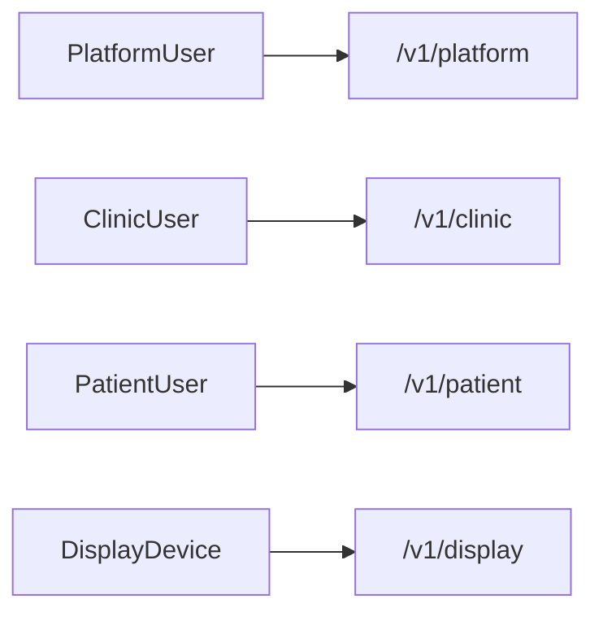
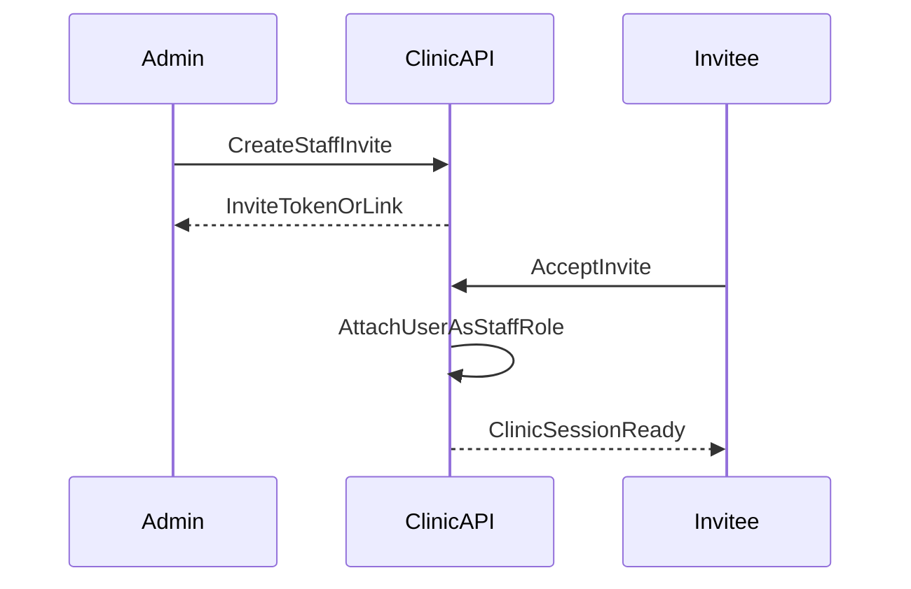

# 05 — Auth, Roles & Platform Ops

## الغرض والنطاق

يعرّف جمهور المصادقة لكل قناة، الأدوار، مصفوفة الصلاحيات، دعوات الموظفين، التدقيق، ومتطلبات إدارة المنصة على مستوى API.

## قرارات مفروضة

- كل قناة لها جمهور هوية منفصل (لا إعادة استخدام توكن Display كـ Clinic staff)
- السياق التشغيلي Clinic/Patient يتضمّن `clinic_id`؛ Display يتضمّن `clinic_id` + `device_id`
- الصلاحيات تُفحص على مستوى القناة ثم الدور ثم ملكية المورد

## جمهور المصادقة حسب القناة

| القناة | نوع الهوية | يصدر ماذا | نطاق البيانات |
|--------|------------|-----------|----------------|
| Platform | PlatformUser | جلسة منصة | موارد المنصة؛ عيادات كقائمة إدارة |
| Clinic | ClinicUser (admin/doctor/staff) | جلسة عيادة | `clinic_id` للعضوية فقط |
| Patient | Patient user | جلسة مريض | حجوزاته + سياق عيادة عند الحجز |
| Display | DisplayDevice | جلسة جهاز | طابور/إعلانات عيادته فقط |

## أدوار المنصة

| الدور | القدرات |
|-------|---------|
| `platform_owner` | كامل: خطط، تعليق عيادات، إصدارات، مستخدمو منصة |
| `platform_support` | قراءة عيادات/اشتراكات، سجلات تدقيق، أدوات دعم محدودة بدون تغيير خطط الأسعار |

## أدوار العيادة

| الدور | ملخص |
|-------|------|
| `admin` | تشغيل كامل + إعدادات + موظفون + فوترة ذاتية |
| `doctor` | تشغيل حجوزات/طابور + إعدادات إن مُنحت؛ بدون إدارة موظفين كاملة افتراضياً |
| `staff` | حجوزات وطابور يومي؛ بدون إعدادات حساسة/موظفين/فوترة |
| `patient` | ليس على سطح Clinic؛ يظهر على Patient فقط |

> تطبيق الأدمن الموبايل واللوحة يستخدمان أدوار Clinic فقط.

## مصفوفة صلاحيات Clinic (مختصر)

| القدرة | admin | doctor | staff |
|--------|-------|--------|-------|
| عرض حجوزات | نعم | نعم | نعم |
| إنشاء/تحديث حجز | نعم | نعم | نعم |
| حذف حجز | نعم | لا* | لا |
| تحكم طابور | نعم | نعم | نعم |
| إعدادات العيادة | نعم | نعم* | لا |
| دعوة موظفين | نعم | لا | لا |
| إدارة إعلانات | نعم | نعم* | محدود* |
| أجهزة Display | نعم | نعم* | لا |
| اشتراك/فواتير | نعم | لا | لا |
| إحصاءات لوحة | نعم | نعم | نعم |

\* الافتراض القابل للضبط لاحقاً عبر سياسات العيادة؛ القيم أعلاه هي الافتراض الوثائقي.

## مصفوفة Patient

| القدرة | زائر عام (slug) | مريض مسجّل الدخول |
|--------|------------------|-------------------|
| رؤية معلومات عيادة عامة | نعم | نعم |
| رؤية التوفر | نعم | نعم |
| إنشاء حجز | حسب سياسة الضيف/التسجيل | نعم |
| عرض مواعيدي | لا | نعم |
| إلغاء ذاتي | لا | نعم لملكيته |
| تتبع تذكرة | بمعرف التذكرة | نعم |

## مصفوفة Display

| القدرة | جهاز مربوط |
|--------|------------|
| قراءة حالة الطابور | نعم |
| تحكم الطابور | لا |
| قراءة إعلانات TV | نعم |
| تعديل إعدادات | لا |

## دعوات الموظفين

قواعد:

- الدعوة مرتبطة بـ `clinic_id` + دور مستهدف + انتهاء صلاحية
- القبول يفشل إن تجاوزت العيادة `max_staff_users`
- إلغاء الدعوة يمنع القبول لاحقاً
- لا تُنشأ حسابات موظفين بكلمات مرور عشوائية دون دعوة (أفضل ممارسة)

## حالة الحساب بعد الدخول

بعد المصادقة على Clinic/Patient يُتحقق من `account_status`:

- غير `active` → رفض التشغيل مع سبب الحالة (موقوف، صيانة، …)
- يتوافق مع شاشات الحالة في التطبيقات الحالية

## تدقيق (Audit)

أحداث تُسجَّل على الأقل:

- تعليق/إعادة تفعيل عيادة (Platform)
- تغيير خطة/استحقاق (Platform)
- دعوة/إلغاء موظف (Clinic)
- تغيير إعدادات حرجة (تعطيل الحجز، السعات) (Clinic)
- حذف حجز (Clinic)
- فشل/نجاح تحصيل مؤثرة على الحالة (نظام الفوترة)

حقول الحدث المفاهيمية: `actor_type`, `actor_id`, `clinic_id?`, `action`, `resource_type`, `resource_id`, `at`, `metadata`

## إدارة المنصة — متطلبات API (ليست UI)

يجب أن يوفّر سطح Platform القدرة على:

1. البحث في العيادات حسب الحالة/الخطة/slug
2. عرض ملخص الاشتراك والفواتير
3. تعليق/إعادة تفعيل مع سبب
4. إدارة الخطط والـ entitlements
5. ضبط حدود إصدارات التطبيقات للقنوات
6. استعراض audit للدعم
7. استقبال webhooks الفوترة بأمان (توقيع)

**لا** يوفّر Platform افتراضياً تحكم طابور يومي أو انتحال موظف إلا عبر أداة دعم صريحة منفصلة ومُدقَّقة (خارج النطاق الافتراضي؛ إن أُضيفت لاحقاً تُوثَّق تحت Platform باسم واضح مثل `/support/...`).

## سياسات جلسة مفاهيمية

- انتهاء access قصير + تجديد عبر refresh لكل من Platform/Clinic/Patient
- جلسة Display قابلة للإبطال من Clinic عند إلغاء الجهاز
- عند `suspended` للعيادة: تُرفض كتابات Patient الجديدة؛ Clinic يتحول لوضع مقيد كما في `02`

## حالة الملف

مرجع الصلاحيات والقنوات للتنفيذ مع `04`.
