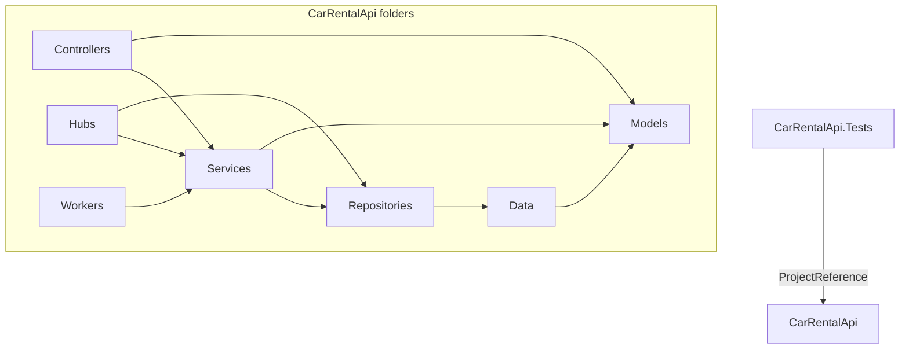
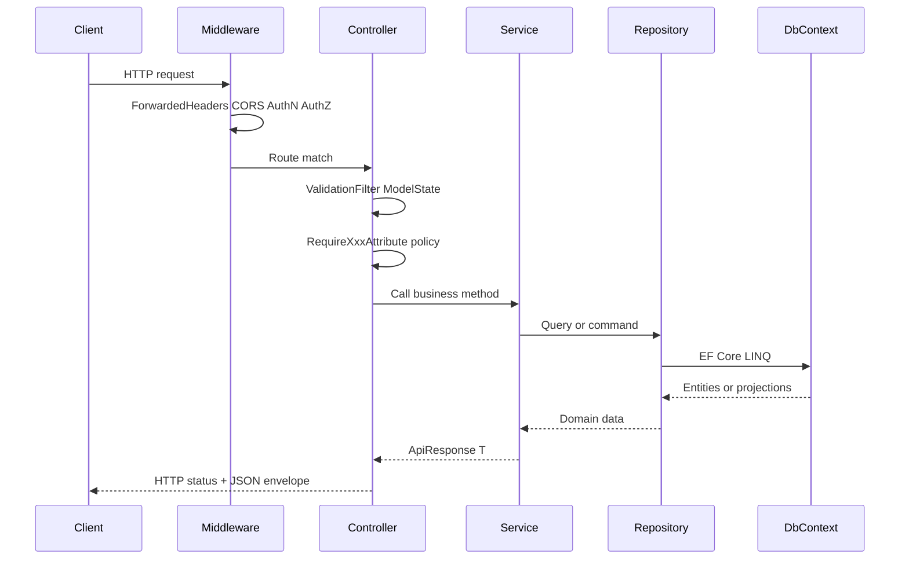

# STRUCTURE_TEMPLATE — قالب هيكل .NET Web API

> **الغرض:** وثيقة هيكلية قابلة لإعادة الاستخدام لبناء SaaS API جديد.  
> **ليست:** توثيقاً للمجال التجاري أو الـ endpoints أو الـ schema.  
> **المصدر:** مستودع `CarRentalApi` — monolith بمجلدات طبقات داخل host واحد.

---

## 1. نظرة عامة (Overview)

| البند | القيمة في هذا المستودع |
|-------|------------------------|
| **Solution name** | لا يوجد `.sln` — مشروعان مستقلان |
| **Host project** | `CarRentalApi.csproj` |
| **Test project** | `CarRentalApi.Tests/CarRentalApi.Tests.csproj` |
| **Target framework** | `net10.0` |
| **Host type** | ASP.NET Core **Web API** — **Controllers** (ليس Minimal APIs) |
| **Root namespace** | `CarRentalApi` |
| **Database** | PostgreSQL عبر EF Core (`Npgsql.EntityFrameworkCore.PostgreSQL`) |
| **Realtime** | SignalR Hubs |
| **Docs UI** | OpenAPI + Scalar |

**فلسفة الهيكل:** monolith منظم بمجلدات (folder-based layering) داخل مشروع Web واحد.  
Controllers رفيعة → Services (business logic) → Repositories (data access) → `AppDbContext`.  
لا توجد مشاريع منفصلة لـ Domain/Application/Infrastructure — كل شيء namespace + folder.

---

## 2. خريطة الحل (Solution map)

```
repo-root/
├── CarRentalApi.csproj          # Web API host (main)
├── Program.cs                   # Composition root (DI + pipeline)
├── appsettings.json
├── appsettings.Development.json
├── Dockerfile
├── docker-compose.yml
│
├── Controllers/                 # HTTP endpoints (by audience)
├── Services/                    # Business logic + external integrations
├── Repositories/                # Data access (EF queries)
├── Data/                        # AppDbContext + factory
├── Models/                      # Entities, DTOs, Enums, ValueObjects
├── Migrations/                  # EF Core migrations
├── Constants/                   # Static keys, route prefixes, roles
├── Attributes/                  # Auth/authorization attributes
├── Authorization/               # Policy definitions
├── Filters/                     # Global action filters
├── Middleware/                  # Custom pipeline middleware
├── Extensions/                  # Helper extension methods
├── Hubs/                        # SignalR hubs
├── Workers/                     # IHostedService background jobs
├── secrets/                     # Local credential files (gitignored)
├── docs/                        # API/feature documentation
└── CarRentalApi.Tests/          # xUnit test project
    ├── Services/
    ├── Filters/
    ├── Attributes/
    ├── Extensions/
    └── Helpers/
```

### المشاريع ومراجعها

| Project | SDK | Responsibility | Project References |
|---------|-----|----------------|-------------------|
| `CarRentalApi` | `Microsoft.NET.Sdk.Web` | HTTP API, DI, EF, SignalR, workers | — |
| `CarRentalApi.Tests` | `Microsoft.NET.Sdk` | Unit tests (xUnit + Moq) | → `CarRentalApi.csproj` |

> ملاحظة: ملفات الاختبار **مستبعدة** من compile في الـ host عبر `<Compile Remove="CarRentalApi.Tests/**/*.cs" />` داخل `CarRentalApi.csproj`.

### مخطط اعتماد المشاريع



---

## 3. الطبقات وقواعد الاعتماد (Layering)

### اتجاه الاعتماد المسموح

```
Controllers  →  Services  →  Repositories  →  Data (AppDbContext)  →  Models
     ↓              ↓
  Models/DTOs   Models/DTOs + Constants + Extensions
```

### قواعد صارمة

| من | إلى | مسموح؟ |
|----|-----|--------|
| `Controllers` | `Services` | ✅ |
| `Controllers` | `Repositories` | ⚠️ نادر — يُفضّل عبر Service |
| `Controllers` | `AppDbContext` | ❌ |
| `Services` | `Repositories` | ✅ |
| `Services` | `AppDbContext` | ⚠️ بعض الخدمات تستخدمه مباشرة للعمليات البسيطة (OTP) — يُفضّل Repository |
| `Repositories` | `AppDbContext` | ✅ |
| `Repositories` | `Services` | ❌ |
| `Models` | أي طبقة أعلى | ❌ |
| `Data` | `Models` | ✅ |

### مسؤولية كل طبقة

| Folder | Responsibility |
|--------|----------------|
| `Controllers/` | HTTP routing, status codes, delegate to services, return `ApiResponse<T>` |
| `Services/` | Business rules, orchestration, external providers (email, SMS, push) |
| `Repositories/` | EF queries, paging, projections (`record` rows), no HTTP concerns |
| `Data/` | `DbContext`, `OnModelCreating`, migrations factory |
| `Models/` | Persistence entities (`EntityBase`), request/response DTOs, enums |
| `Constants/` | Route prefixes, API versions, system keys — no runtime logic |
| `Hubs/` | SignalR connection groups, thin — delegate persistence to repos/services |
| `Workers/` | Scheduled/background work via `IHostedService` |

---

## 4. اتفاقيات المجلدات داخل الـ API host

### Controllers — التجميع حسب الجمهور (Audience)

```
Controllers/
├── Admin/          # Back-office operators
├── Customer/       # End-user app (tenant A persona)
├── Owner/          # Business-user app (tenant B persona)
├── Auth/           # Shared auth endpoints
├── Devices/        # Push device registration
├── Settings/       # Public/unauthenticated settings
└── ImageController.cs   # Cross-cutting resource (root level OK)
```

**Route pattern:**

```csharp
[ApiVersion(ApiVersions.V1)]
[Route($"api/v{{version:apiVersion}}/{RoutePrefixes.Customer}/auth")]
[ApiController]
public class CustomerAuthController : ControllerBase { }
```

- `RoutePrefixes` في `Constants/RoutePrefixes.cs` — قيم ثابتة: `customer`, `owner`, `admin`, `auth`.
- `ApiVersions.V1` في `Constants/ApiVersions.cs`.
- URL versioning عبر `UrlSegmentApiVersionReader` → `/api/v1/customer/...`.

### Services & Repositories — التسمية

| Pattern | Example |
|---------|---------|
| Interface | `IUserRepository`, `IBookingService` |
| Implementation | `UserRepository`, `BookingService` |
| Settings class | `JwtSettings`, `ResendSettings` — مع `SectionName` const |
| Mapper (static) | `AdminBookingMapper`, `WalletTopUpMapper` |
| Helper (static) | `PhoneLinkingHelper`, `VehiclePricingHelper` |
| Null/Log stub | `NullFcmPushService`, `LogEmailSender`, `DisabledGoogleIdTokenVerifier` |

كل Service/Repository يُسجَّل في `Program.cs` كـ `AddScoped<Interface, Implementation>()`.

### DI registration — أين يعيش كل شيء

| Concern | Location |
|---------|----------|
| All service registration | `Program.cs` (composition root) |
| Options binding | `builder.Services.Configure<TSettings>(section)` |
| Conditional providers | `if/else` في `Program.cs` (e.g. Smssak vs Mock OTP) |
| Auth policies | `Authorization/AuthorizationPolicies.cs` → `ConfigurePolicies()` |
| Global filters | `builder.Services.AddControllers(options => options.Filters.Add<...>())` |
| Middleware | `Middleware/` classes + `app.UseMiddleware<T>()` |
| SignalR hubs map | `app.MapHub<T>("/hubs/...")` |
| Background workers | `builder.Services.AddHostedService<T>()` |
| DB migrate on startup | `Program.cs` — scoped block after `app.Build()` |

### Middleware pipeline (الترتيب الفعلي)

```
UseForwardedHeaders()
→ ScalarBasicAuthMiddleware
→ UseHttpsRedirection()
→ UseCors()
→ UseStaticFiles()
→ UseAuthentication()
→ UseAuthorization()
→ MapOpenApi() + MapScalarApiReference()
→ MapControllers()
→ MapHub<ChatHub>() / MapHub<NotificationsHub>()
```

### Namespaces

```
CarRentalApi.Controllers.{Audience}
CarRentalApi.Services
CarRentalApi.Repositories
CarRentalApi.Data
CarRentalApi.Models
CarRentalApi.Models.DTOs
CarRentalApi.Models.DTOs.{Area}    # e.g. Auth, Admin
CarRentalApi.Models.Enums
CarRentalApi.Constants
CarRentalApi.Attributes
CarRentalApi.Authorization
CarRentalApi.Filters
CarRentalApi.Middleware
CarRentalApi.Extensions
CarRentalApi.Hubs
CarRentalApi.Workers
```

---

## 5. الأنماط المشتركة (Cross-cutting patterns)

> يُوثَّق هنا **ما هو موجود فعلاً** في المستودع.

### 5.1 Response envelope — `ApiResponse<T>`

**Path:** `Models/DTOs/ApiResponse.cs`

```csharp
public class ApiResponse<T>
{
    public string Message { get; set; }
    public T? Data { get; set; }
    public bool Status { get; set; }
    public int Code { get; set; }
}
```

- Controllers ترجع `ActionResult<ApiResponse<T>>`.
- HTTP status يُعيَّن يدوياً: `Ok(result)`, `Unauthorized(result)`, `Conflict(result)`.
- **لا** يستخدم ASP.NET ProblemDetails (`RFC 7807`).

**إضافة feature جديدة:** أنشئ DTOs تحت `Models/DTOs/{Area}/`، ارجع `ApiResponse<YourDto>`.

---

### 5.2 Validation

| Piece | Location |
|-------|----------|
| Global filter | `Filters/ValidationFilterAttribute.cs` |
| DTO attributes | `[Required]`, `[EmailAddress]`, `[MaxLength]` على request DTOs |
| Error shape | `ApiResponse<ValidationErrorsDto>` مع HTTP 400 |

**إضافة feature:** ضع DataAnnotations على Request DTO — الفلتر العالمي يتولى الباقي.

---

### 5.3 Authentication & Authorization

| Piece | Location |
|-------|----------|
| JWT Bearer | `Program.cs` — `AddAuthentication().AddJwtBearer()` |
| Token service | `Services/IJwtService.cs`, `JwtService.cs` |
| Password hashing | `Services/IPasswordService.cs`, `PasswordService.cs` (BCrypt) |
| Policies | `Authorization/AuthorizationPolicies.cs` |
| Role attributes | `Attributes/RequireCustomerAttribute.cs`, `RequireOwnerAttribute.cs`, `RequireAdminAttribute.cs` |
| User ID from claims | `Extensions/ClaimsPrincipalExtensions.cs` → `GetRequiredUserId()` |
| Auth result handler | `Authorization/CustomAuthorizationMiddlewareResultHandler.cs` |
| Extra filter | `Filters/AuthenticatedUserIdAuthorizationFilter.cs` |

**JWT config:** `JwtSettings` — `SecretKey`, `Issuer`, `Audience`, `ExpirationMinutes`.

**SignalR auth:** token من query `access_token` أو Authorization header في `JwtBearerEvents.OnMessageReceived`.

**إضافة persona جديدة:**  
1. أضف role في `Constants/UserRoles.cs`  
2. Policy في `AuthorizationPolicies.cs`  
3. Attribute جديد في `Attributes/`  
4. Controller folder + `RoutePrefixes` entry

---

### 5.4 Options pattern

كل external integration له `*Settings` class:

```
Services/JwtSettings.cs          → SectionName = "JwtSettings"
Services/ResendSettings.cs       → SectionName = "Resend"
Services/FirebaseSettings.cs     → SectionName = "Firebase"
Services/OtpSettings (Smssak...) → SectionName = "OtpSettings"
```

Registration:

```csharp
builder.Services.Configure<JwtSettings>(
    builder.Configuration.GetSection(JwtSettings.SectionName));
```

**إضافة integration:** class settings + section في `appsettings.json` + `Configure<>` + inject `IOptions<T>`.

---

### 5.5 API Versioning

- Package: `Asp.Versioning.Mvc` + `ApiExplorer`
- Default: v1.0, URL segment reader
- Controllers: `[ApiVersion(ApiVersions.V1)]`

---

### 5.6 Repository pattern

- Interface + implementation في `Repositories/` (same folder, not subfolders)
- List endpoints تستخدم lightweight `record` projections (e.g. `UserListRow`) بدل full entities
- Lifetime: **Scoped**

**إضافة aggregate جديد:**
1. Entity في `Models/` extends `EntityBase`
2. `DbSet<T>` في `AppDbContext`
3. `IThingRepository` + `ThingRepository`
4. Register in `Program.cs`
5. EF migration in `Migrations/`

---

### 5.7 Entity base

**Path:** `Models/EntityBase.cs`

```csharp
public abstract class EntityBase
{
    public Guid Id { get; set; } = Guid.NewGuid();
    public DateTime CreatedAt { get; set; } = DateTime.UtcNow;
    public DateTime UpdatedAt { get; set; } = DateTime.UtcNow;
}
```

---

### 5.8 External provider stubs

Pattern للتبديل بين production/dev/disabled:

| Enabled | Disabled |
|---------|----------|
| `ResendEmailSender` | `LogEmailSender` |
| `FirebasePushService` | `NullFcmPushService` |
| `SmssakPhoneAuthProvider` | `MockPhoneAuthProvider` |
| `GoogleIdTokenVerifier` | `DisabledGoogleIdTokenVerifier` |

يُختار في `Program.cs` بناءً على config flag.

---

### 5.9 SignalR realtime

| Hub | Path | Auth |
|-----|------|------|
| `ChatHub` | `/hubs/chat` | `[Authorize]` + hub methods |
| `NotificationsHub` | `/hubs/notifications` | `[Authorize]` |

Notifiers: `Services/ChatRealtimeNotifier.cs`, `NotificationRealtimeNotifier.cs` — injected into services.

---

### 5.10 Background workers

**Path:** `Workers/ScheduledNotificationWorker.cs`  
Registered: `builder.Services.AddHostedService<ScheduledNotificationWorker>()`

---

### 5.11 ما **ليس** موجوداً

| Pattern | Status |
|---------|--------|
| MediatR / CQRS | ❌ |
| AutoMapper | ❌ — static mapper classes instead |
| FluentValidation | ❌ — DataAnnotations only |
| ProblemDetails (RFC 7807) | ❌ |
| Separate Domain/Application projects | ❌ |
| Health checks endpoint | ❌ |
| Integration test project | ❌ |

---

### 5.12 Request flow (generic)



---

## 6. الإعدادات والبيئات (Configuration)

### ملفات config

| File | Purpose |
|------|---------|
| `appsettings.json` | Production defaults — connection strings, JWT, integrations |
| `appsettings.Development.json` | Dev overrides (minimal — e.g. maintenance pins) |

### أقسام config الشائعة (pattern — لا تنسخ القيم)

```json
{
  "ConnectionStrings": { "DefaultConnection": "..." },
  "JwtSettings": { "SecretKey", "Issuer", "Audience", "ExpirationMinutes" },
  "CorsSettings": { "AllowedOrigins": [] },
  "{Integration}Settings": { "Enabled", "...": "..." }
}
```

### Secrets

- Credential files: `secrets/` folder (e.g. service account JSON)
- Path referenced in config: `"CredentialsPath": "secrets/..."`
- `.gitignore` يستبعد `secrets/*.json`
- API keys في `appsettings.json` حالياً — **للمشروع الجديد:** استخدم User Secrets / env vars / vault

### Startup behavior

- `Program.cs` يشغّل `db.Database.MigrateAsync()` عند الإقلاع
- Seed logic (admin user) في scoped block بعد migrate — dev/first-run pattern

### Docker

- `Dockerfile` + `docker-compose.yml` في جذر المستودع
- `UseForwardedHeaders()` configured for reverse proxy (Nginx)

### launchSettings

- موجود في `Repositories/Properties/launchSettings.json` (non-standard location)
- للمشروع الجديد: ضعه في `Properties/launchSettings.json` under host project

---

## 7. هيكل الاختبارات (Testing layout)

### Project: `CarRentalApi.Tests`

| Package | Use |
|---------|-----|
| xUnit | Test framework |
| Moq | Mock interfaces |
| EF Core Sqlite | In-memory DB for service tests |
| EF Core InMemory | Alternative provider (available) |

### Folder mirror

```
CarRentalApi.Tests/
├── Services/       # Majority — service-level unit tests (~70 files)
├── Filters/        # Filter behavior tests
├── Attributes/     # Authorization attribute tests
├── Extensions/     # Extension method tests
└── Helpers/        # Shared test utilities / seed builders
```

### Naming convention

```
{ClassUnderTest}Tests.cs
{MethodName}_{Scenario}_{ExpectedResult}()
```

Example: `EmailAuthServiceTests.cs` → `Login_BeforeEmailVerified_Returns403()`

### Test patterns used here

| Pattern | Description |
|---------|-------------|
| Service unit test | Real `AppDbContext` on Sqlite `:memory:` + real repositories + mocked externals |
| Mock external IO | `Mock<IEmailSender>`, `Mock<IFcmPushService>` |
| Test seed helpers | `*TestSeed.cs`, `*TestHelper.cs` in Services/ or Helpers/ |
| No WebApplicationFactory | No full HTTP integration tests in this repo |

**إضافة tests لميزة جديدة:**  
1. Create `{Service}Tests.cs` under `CarRentalApi.Tests/Services/`  
2. Setup in-memory DbContext + real repo + mock external deps  
3. Assert on `ApiResponse<T>.Status`, `.Code`, `.Data`

---

## 8. قائمة scaffold لمشروع API جديد (Checklist)

انسخ هذا الهيكل لمشروع SaaS جديد (غيّر `YourProduct` عن `CarRentalApi`):

### Phase 1 — Projects

- [ ] `YourProduct.Api.csproj` — `Microsoft.NET.Sdk.Web`, `net10.0`
- [ ] `YourProduct.Api.Tests.csproj` — xUnit + Moq + ProjectReference
- [ ] (Optional) `YourProduct.sln` — if you want a solution file

### Phase 2 — Root folders (host)

- [ ] `Program.cs` — composition root
- [ ] `Controllers/{Admin,Customer,Owner,Auth,Devices,Settings}/`
- [ ] `Services/` — start with `IJwtService`, `IPasswordService`, `IAuthService`
- [ ] `Repositories/` — start with `IUserRepository`
- [ ] `Data/AppDbContext.cs` + `AppDbContextFactory.cs`
- [ ] `Models/EntityBase.cs`
- [ ] `Models/DTOs/ApiResponse.cs`
- [ ] `Models/Enums/`
- [ ] `Constants/RoutePrefixes.cs`, `ApiVersions.cs`, `UserRoles.cs`
- [ ] `Attributes/RequireCustomerAttribute.cs` (+ Owner, Admin)
- [ ] `Authorization/AuthorizationPolicies.cs`
- [ ] `Filters/ValidationFilterAttribute.cs`
- [ ] `Extensions/ClaimsPrincipalExtensions.cs`
- [ ] `Migrations/`

### Phase 3 — Program.cs registrations

- [ ] `Configure<JwtSettings>` + other `*Settings`
- [ ] `AddDbContext<AppDbContext>` (PostgreSQL)
- [ ] `AddControllers` + global filters + camelCase JSON + enum string converter
- [ ] `AddApiVersioning` (URL segment)
- [ ] `AddAuthentication().AddJwtBearer()`
- [ ] `AuthorizationPolicies.ConfigurePolicies()`
- [ ] `AddCors` from config
- [ ] `AddOpenApi()` + Scalar
- [ ] Register all `IRepository` → impl, `IService` → impl (Scoped)
- [ ] Pipeline: ForwardedHeaders → HTTPS → CORS → Auth → Controllers

### Phase 4 — First vertical slice (auth)

- [ ] `User` entity + migration
- [ ] `IUserRepository` / `UserRepository`
- [ ] `IAuthService` / `AuthService`
- [ ] `{Audience}AuthController` with login/refresh
- [ ] `EmailAuthServiceTests` pattern for first service test

### Phase 5 — Cross-cutting as needed

- [ ] SignalR: `Hubs/` + `MapHub` + JWT query token
- [ ] Worker: `Workers/` + `AddHostedService`
- [ ] External provider: `*Settings` + interface + real impl + Null/Log stub
- [ ] `Middleware/` for docs auth or custom headers
- [ ] `docker-compose.yml` + `Dockerfile`
- [ ] `.gitignore` — bin/, obj/, secrets/

### Phase 6 — Conventions to keep

- [ ] Routes: `api/v{version}/{audience}/{resource}`
- [ ] All responses: `ApiResponse<T>` envelope
- [ ] DTOs grouped: `Models/DTOs/{Area}/`
- [ ] Settings classes colocated with services (`Services/JwtSettings.cs`)
- [ ] DI only in `Program.cs` — no `[Inject]` or secondary containers

---

## 9. أهداف غير مقصودة (Explicit non-goals)

عند استخدام هذا القالب لمشروع SaaS **جديد**، **لا**:

| Do NOT copy | Why |
|-------------|-----|
| Domain entities (`User`, `Booking`, `Car`, …) | Product-specific |
| Database schema / migrations content | Product-specific |
| Business endpoints and routes | Product-specific |
| `docs/*.md` API guides | Product-specific |
| Seed data (admin email, wilayas, brands JSON) | Product-specific |
| Integration config values (Firebase, Smssak, Resend keys) | Environment-specific |
| Feature-specific services (BookingService, CarService, …) | Product-specific |

**DO copy:** folder layout, naming patterns, layering rules, `ApiResponse<T>`, auth pipeline, DI style, test structure, config section pattern, provider stub pattern.

---

## ملحق — Packages reference (host)

| Area | NuGet packages |
|------|----------------|
| Web | `Microsoft.AspNetCore.OpenApi`, `Scalar.AspNetCore` |
| EF Core | `Microsoft.EntityFrameworkCore`, `Npgsql.EntityFrameworkCore.PostgreSQL`, `Design` |
| Auth | `Microsoft.AspNetCore.Authentication.JwtBearer`, `System.IdentityModel.Tokens.Jwt` |
| Versioning | `Asp.Versioning.Mvc`, `Asp.Versioning.Mvc.ApiExplorer` |
| Security | `BCrypt.Net-Next` |
| Images | `SixLabors.ImageSharp` |
| Push (optional) | `FirebaseAdmin` |
| Social auth (optional) | `Google.Apis.Auth` |

## ملحق — Packages reference (tests)

| Package | Purpose |
|---------|---------|
| `Microsoft.NET.Test.Sdk` | Test runner |
| `xunit` + `xunit.runner.visualstudio` | Framework |
| `Moq` | Mocking |
| `Microsoft.EntityFrameworkCore.Sqlite` | In-memory DB tests |
| `coverlet.collector` | Coverage |

---

*Generated from repository structure inspection. Last aligned with: single-project monolith, net10.0, Controllers + folder-based layering.*
